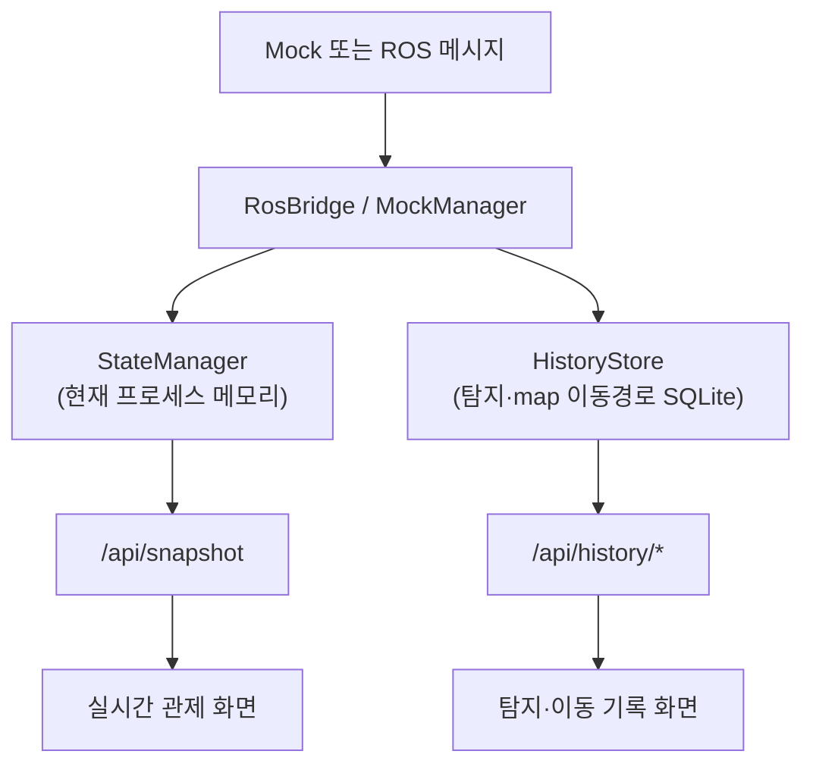

# UnderGuard System Monitor

두 대의 AMR 상태와 위치, 카메라 상태, 탐지 이벤트를 한 화면에서 확인하는 Flask 기반 실시간 관제 UI입니다. `main`의 Fleet 인터페이스를 우선 사용하며 Mock과 ROS 모드는 같은 상태 모델과 화면을 공유합니다.

실시간 로봇·임무·이벤트 상태는 프로세스 메모리에서 관리하고, 탐지와 map
좌표계의 로봇 이동 경로는 별도 `HistoryStore` SQLite에 저장합니다. 기록 화면은
이 DB를 읽기 전용 API로 조회하며 로그인, 기록 수정·삭제와 데이터 초기화 기능은
제공하지 않습니다.

## 초기 화면 설계와 마크업

System Monitor는 화면 구현에 앞서 운영자가 한 화면에서 두 로봇의 상태와
현장 상황을 판단할 수 있도록 정보 영역과 데이터 흐름을 먼저 구분했습니다.
별도의 Figma 디자인 목업은 없지만, 다음과 같은 화면 뼈대를 기준으로
대시보드를 구성했습니다.

```text
┌──────────────┬────────────────────────┬──────────────┐
│ 로봇 상태     │ SLAM 지도              │ 카메라 영상   │
│              │                        │               │
│ 연결 상태     │ 로봇 위치와 방향       │ 탐지 결과      │
│ 배터리        │ 이동 경로              │               │
│ 현재 작업     │ 탐지·덫·위험 마커      │               │
├──────────────┴────────────────────────┴──────────────┤
│ 최근 이벤트와 경고                                       │
└─────────────────────────────────────────────────────┘
```

- 왼쪽 영역: 로봇 선택, 연결 상태, 임무 상태, 배터리, 위치
- 중앙 영역: 정적 SLAM 맵, 로봇 위치·방향·이동 경로, 탐지·덫 마커
- 오른쪽 영역: 로봇별 카메라 상태와 현재 탐지 결과
- 이벤트 영역: 현재 실행 중 수신한 상태 변화, 탐지, 운영 경고

설계 문맥에서 사용하는 용어의 의미는 다음과 같습니다.

- **와이어프레임**: 화면에 어떤 정보를 어디에 배치할지 나타낸 구조적 뼈대
- **목업(Mockup)**: 색상과 시각 디자인까지 반영한 완성 화면 예시
- **마크업(Markup)**: 화면 설계를 실제 웹 구조로 옮긴 HTML
- **시스템 구성도**: ROS 데이터가 서버와 API를 거쳐 화면에 도달하는 흐름도

이 프로젝트의 초기 설계 자료는
[`docs/NOTION_SYSTEM_MONITOR_OVERVIEW.md`](docs/NOTION_SYSTEM_MONITOR_OVERVIEW.md)에
정리되어 있으며, 실제 HTML 마크업은
[`frontend/templates/dashboard.html`](frontend/templates/dashboard.html)에 구현되어
있습니다. 따라서 코드 리뷰에서 초기 설계 또는 마크업을 묻는 것은 코딩을
바로 시작했는지가 아니라, 표시할 정보의 우선순위와 배치, 데이터 연결 방식을
먼저 정의한 뒤 구현했는지를 확인하는 질문으로 이해할 수 있습니다.

## 현재 구현 범위

- 두 로봇의 연결, 상태, 배터리, 속도와 현재 작업 표시
- 정적 ROS 맵(PGM/YAML) 배경과 실제 좌표 변환, 화면에는 보기 편하게 90도 회전해서 표시
- 로봇 위치·방향·이동 경로 표시
- 현재 실행 중 수신한 탐지·덫 마커와 최근 이벤트 표시
- `LIVE_RODENT`, `ENTRY_POINT`, `DROPPINGS` 표준 위험신호 변환
- 최초 쥐 탐지 기반 추적/지원 역할 표시, 전체 임무 상태는 로봇 state 우선순위로 매번 자동 계산
- 대상 유실 시 마지막 표적 위치 유지
- Offline 판정과 재접속 시 자동 복구, 저전압 경고 및 카드의 운영 의미(복귀 권장·신규 확인 임무 제한) 표시
- Mock 로봇·탐지 좌표를 실제 맵 경계 안에서 자동 계산(맵 파일이 바뀌어도 좌표가 안 어긋남)
- Mock 자동 시나리오와 수동 테스트 이벤트(배터리 부족→복구 흐름 포함)
- main Fleet 상태·사건의 읽기 전용 수신
- 카메라 실시간 프레임 구독·캐시·API 배선(`camera_service.py`), 탐지에 증거 이미지 링크 첨부
- ROS Detection과 `/fleet/event` 탐지의 SQLite 영속 기록
- map 좌표계 odom의 주기 제한 이동 경로 기록
- 기간·종류·Robot 필터를 지원하는 탐지·이동 기록 조회와 증거 이미지 확인

카메라 배선은 main의 `camera_node.py`가 실제 발행하는 `synced/rgb`
(`sensor_msgs/CompressedImage`)에 맞춰 구독·캐시·`/api/camera/<robot_id>/frame`
API까지 준비됐고, 실제 ROS 메시지로 끝까지 확인했습니다. 다만 **실물 로봇
카메라로는 아직 확인하지 못했습니다** — Mock 모드에서는 여전히 자리 표시
화면이 나오고, ROS 모드는 프레임이 오기 전까지 동일한 자리 표시로
자동 대체됩니다.

## 데이터 경계



- 로봇·임무·최근 이벤트는 메모리 상태이며 서버 재시작 시 초기화됩니다.
- ROS 모드의 탐지와 map 좌표 이동경로는 `backend/data/history.db`에 남습니다.
- `odom` 등 map이 아닌 좌표는 지도 좌표로 가장하지 않고 이동 이력 저장에서
  제외합니다. 실제 TF 또는 map 기준 위치 토픽 연결이 필요합니다.
- 고주파 입력은 탐지 기본 1초, 이동 경로 기본 0.5초 간격으로 제한해 저장합니다.
- 카메라 프레임은 이 그림과 별개 경로입니다 — `StateManager`를 거치지 않고
  `RosBridge` → `camera_service.py`(메모리 캐시) → `/api/camera/<robot_id>/frame`로
  바로 내려갑니다(원본 바이트가 `/api/snapshot`의 JSON 직렬화를 무겁게 하지 않도록).
- Opening, Trap, Incident와 Robot Mission의 운영 MySQL은 로봇 측 DB가 소유하며,
  별도 조회 계약이 확정된 뒤 필요한 값만 연결합니다.
- 기록 보고서 생성과 기록 수정·삭제는 현재 개발 범위가 아닙니다.

## Mock/ROS 공통 계약

| 항목 | Mock | ROS |
|---|---|---|
| 화면·스냅샷 구조 | 공통 | 공통 |
| 위험신호 이름 | 표준값 사용 | 표준값 사용 |
| 사건 보관 | 프로세스 메모리 | 프로세스 메모리 |
| 탐지·이동 이력 | 더미 시드로 확인 | HistoryStore에 자동 저장 |
| 테스트 사건 버튼 | 표시 | 숨김 |
| 카메라 프레임 | 항상 자리 표시 | 실제 프레임 시도, 없으면 자리 표시로 자동 대체 |

ROS 입력과 제약은 [ROS 인터페이스 명세](docs/ROS_INTERFACE_SPEC.md), 현재 개발 순서는 [System Monitor 책임 범위](docs/SYSTEM_MONITOR_SCOPE.md)를 기준으로 확인합니다.

## 실행

이 문서 아래 `backend/`에 실제 실행 대상(Flask 패키지·스크립트)이 있습니다.

```bash
cd backend
python3 -m pip install --user -r requirements.txt
./run_mock.sh
```

접속 주소는 `http://localhost:5000`입니다. 로그인 단계는 없습니다.

ROS 모드는 ROS 2와 프로젝트 워크스페이스를 먼저 로드합니다.

```bash
source /opt/ros/humble/setup.bash
source ~/turtlebot4_ws/install/setup.bash
export ROBOT_NAMESPACES=robot4,robot6
export ROBOT_ROLES=SCOUT,SCOUT
cd backend
./run_ros.sh
```

실제 연결 전 `ros2 topic list -t`와 `ros2 topic echo /fleet/status`로 토픽 이름, 타입, 값이 main 계약과 맞는지 확인해야 합니다.

## 쥐몰이 rosbag 기록 변환

쥐몰이 기록 화면의 직접 입력은 Replay JSON입니다. 실제 시험 원본을 rosbag2로
보관한 경우에만 선택적으로 `backend/convert_rosbag_to_replay.py`를 사용해 화면용
Replay JSON으로 변환할 수 있습니다.

```bash
cd backend
python3 convert_rosbag_to_replay.py \
  ~/under_guard_bags/trial_001 \
  data/trial_001_replay.json \
  --model field_algorithm_v1 \
  --goal-name bottom
```

기록할 토픽, 지도 복사, 여러 시험 추가와 오류 해결 순서는
[rosbag2 변환 가이드](docs/ROSBAG_TO_REPLAY_GUIDE.md)를 참고합니다.

## 주요 ROS 인터페이스

| 토픽 | 처리 |
|---|---|
| `/fleet/status` | `robot:state:battery`를 연결·상태·배터리로 변환 |
| `/fleet/event` | `event:x:y`를 현재 탐지·덫 마커로 변환하고 탐지는 HistoryStore에 저장 |
| `/<namespace>/odom` | 위치·방향·속도 입력. frame이 `map`일 때 이동 이력에도 저장 |
| `/<namespace>/battery_state` | 배터리 보조 입력, 실제 토픽 확인 필요 |
| `/<namespace>/*/detections` | 상세 탐지 입력을 현재 상태와 HistoryStore에 함께 저장 |
| `/<namespace>/synced/rgb` | 카메라 프레임(`CompressedImage`) 캐시 후 `/api/camera/<robot_id>/frame`로 제공 |

## 테스트

```bash
cd backend
python3 -m unittest discover -s tests -v
```

현재 앱 라우트, Mock/ROS 계약, 기록 저장·필터, DB 스키마 이전, 맵 변환,
상태 관리, Replay, rosbag 변환과 카메라 캐시 테스트를 함께 유지합니다.

## 프로젝트 구조

저장소 루트에서 `src/`(main의 `turtle_project`/`turtle_interfaces`가 있는 곳)와
같은 층에 있으며, 화면(frontend)과 서버 로직(backend)을 물리적으로 분리합니다.

```text
Sysmon/
├── README.md                  # 이 문서
├── docs/
├── backend/
│   ├── requirements.txt
│   ├── .env.example
│   ├── run_mock.sh
│   ├── run_ros.sh
│   ├── tests/
│   └── system_monitor/
│       ├── app.py               # Flask 화면/API와 실행 수집기 조립 (frontend/ 폴더를 명시적으로 연결)
│       ├── config.py            # 실행 모드·로봇·맵·토픽 설정
│       ├── state_manager.py     # 현재 실행 중 상태의 메모리 집계
│       ├── detection_service.py # 탐지·경고를 공통 상태로 변환
│       ├── mock_manager.py      # 장비 없는 시연 데이터 생성
│       ├── ros_bridge.py        # ROS/Fleet 메시지의 읽기 전용 변환
│       ├── map_service.py       # PGM/YAML 로딩과 PNG 변환
│       ├── camera_service.py    # 로봇별 최신 카메라 프레임 메모리 캐시
│       ├── history_store.py     # 탐지·이동 경로 SQLite 영속 기록
│       ├── replay_manager.py    # 쥐몰이 Replay JSON 실행·기록 조회
│       └── runtime_service.py   # Mock/ROS 공통 인터페이스
└── frontend/
    ├── templates/dashboard.html
    └── static/
```

## 다음 통합 우선순위

1. 실제 `/fleet/status`로 두 로봇 상태·배터리 검증
2. 실제 TF/odom과 정적 맵의 좌표계 일치
3. `/fleet/event`의 로봇 ID 및 탐지 필드 계약 확정
4. Offline·재연결·대상 유실 현장 시험 (판정·자동 복구 로직은 단위 테스트로 확인됨, 실제 로봇 현장 시험만 남음)
5. 실제 카메라(`synced/rgb`)로 배선 검증 — 토픽·메시지 형식은 main과 맞춰
   구독·API까지 준비됐고 합성 메시지로는 확인함, 실물 카메라 확인만 남음
6. 로봇 제어는 `central_node` 소유로 유지하고 관제 입력 계약 문서화

사업 요구사항 문서는 참고 자료이며 현재 구현 순서의 기준이 아닙니다.
