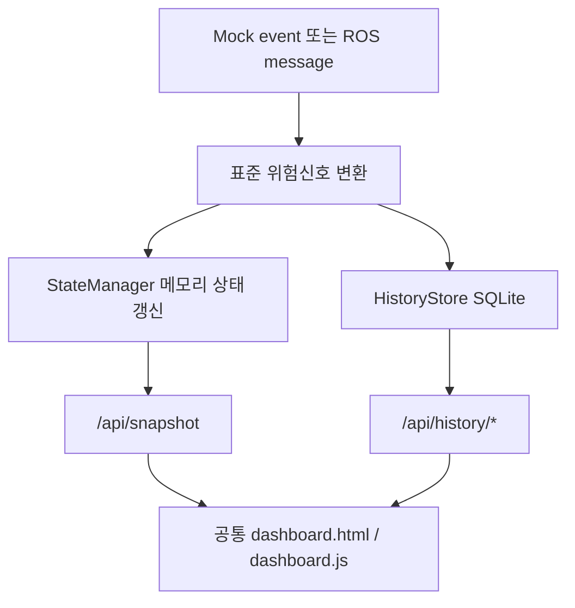

# Mock/ROS 모드 정합성

두 모드는 같은 읽기 전용 상태 모델, 화면, API 응답을 사용한다. 입력원만 다르다.



표준 위험신호는 `LIVE_RODENT`, `ENTRY_POINT`, `DROPPINGS` 세 값이다.

## 공통 기능

- 두 로봇 상태와 카메라 카드
- 지도, 이동 경로, 현재 세션 탐지·덫 마커
- 현재 세션 이벤트와 경고 배너
- `/api/health`, `/api/snapshot`, `/api/map`
- 탐지·map 이동 경로 기록과 `/api/history/*` 조회

로그인, 기록 수정·삭제, 데이터 초기화 API와 로봇 명령 API는 두 모드 모두 없다.

## 의도적인 차이

| 항목 | 이유 |
|---|---|
| Mock 테스트 버튼 | ROS 화면에 가짜 사건이 섞이지 않도록 Mock에서만 표시 |
| 실제 영상 | 전송 계약 확정 전까지 두 모드 모두 상태 UI만 표시 |
| 기록 입력 | Mock은 더미 시드로 검증하고 ROS는 실제 탐지와 map frame odom을 자동 저장 |

ROS의 odom 좌표는 TF 변환 전까지 map 위치로 가장하지 않는다. 탐지와 트랩 좌표도 설정된 map frame임이 확인된 경우만 지도에 표시한다.

## 검증

```bash
cd backend
python3 -m unittest discover -s tests -v
./run_mock.sh
./run_ros.sh
```

실제 ROS 시험 전에는 `ros2 topic list -t`로 namespace와 메시지 타입을 확인한다.
