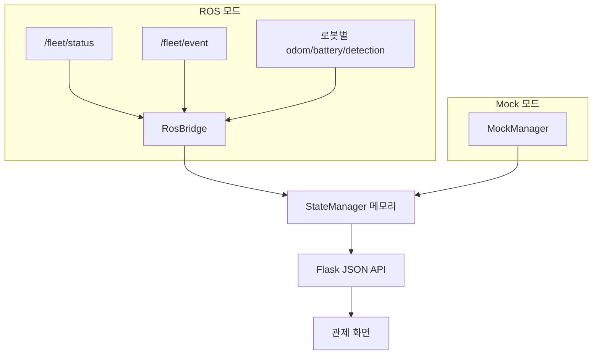

# UnderGuard System Monitor 개요

## 목적

두 대의 AMR에서 들어오는 실시간 상태와 사건을 운영자가 한 화면에서 판단할 수 있게 한다. System Monitor는 로봇 제어·탐지 알고리즘이나 영구 데이터 저장소를 소유하지 않는다.

## 데이터 흐름

(Mock/ROS는 `MONITOR_MODE`에 따라 둘 중 하나만 동시에 실행되며, 어느 쪽이든
결과는 같은 StateManager 메모리로 모인다.)

수신된 탐지·사건·덫 정보는 현재 서버 실행 중에만 유지되고 재시작 시 사라진다.

## 화면 구성

- 왼쪽: 로봇 선택, 연결·상태·배터리·위치
- 중앙: 정적 SLAM 맵, 위치·방향·이동 경로, 현재 세션 마커
- 오른쪽: 로봇별 카메라 상태와 현재 탐지
- 이벤트: 현재 세션에서 받은 상태 변화·탐지·경고

## 위험신호

| 표준값 | 화면 의미 |
|---|---|
| `LIVE_RODENT` | 살아 있는 설치류 |
| `ENTRY_POINT` | 쥐구멍·침입구 후보 |
| `DROPPINGS` | 배설물 흔적 |

## 실행 모드

- Mock: 장비 없이 이동과 사건 흐름을 시연한다.
- ROS: main Fleet 토픽과 선택적 로봇별 센서 토픽을 수신한다.

두 모드는 같은 `StateManager`, Flask API, HTML/JavaScript를 사용한다. Mock 전용 사건 버튼만 실행 모드로 구분한다.

## 의도적으로 제외한 기능

- 사용자 인증과 권한
- 로컬 영구 저장소
- 과거 탐지·사건 조회와 검색
- 탐지 검토·메모·보고서
- 운영 데이터 초기화
- 로봇 명령 발행과 제어 화면

로봇 측 DB가 구현되면 소유권과 조회 인터페이스를 먼저 합의한 뒤 필요한 기능만 별도 개발한다.

## 파일 구조

| 파일 | 역할 |
|---|---|
| `app.py` | Flask 화면/API와 수집기 조립 |
| `config.py` | 모드, 로봇, 맵, 토픽 설정 |
| `state_manager.py` | 현재 로봇·임무·사건 메모리 상태 |
| `detection_service.py` | 탐지와 경고의 공통 상태 변환 |
| `mock_manager.py` | Mock 이동·사건 시나리오 |
| `ros_bridge.py` | ROS/Fleet 상태·사건 구독과 화면 상태 변환 |
| `map_service.py` | PGM/YAML 로딩과 좌표 메타데이터 |
| `dashboard.html/js/css` | 실시간 관제 화면 |

## 다음 통합 순서

1. 실제 `/fleet/status` 상태·배터리 확인
2. 실제 TF/odom과 지도 frame 확인
3. `/fleet/event`의 로봇 귀속과 필드 확장 합의
4. Offline·대상 유실·저전압 시험
5. 실제 카메라 영상 연결
6. `central_node`의 제어 결과를 표시할 상태 계약 확정

상세 개발 기준은 `SYSTEM_MONITOR_SCOPE.md`, 토픽 계약은 `ROS_INTERFACE_SPEC.md`를 따른다.
