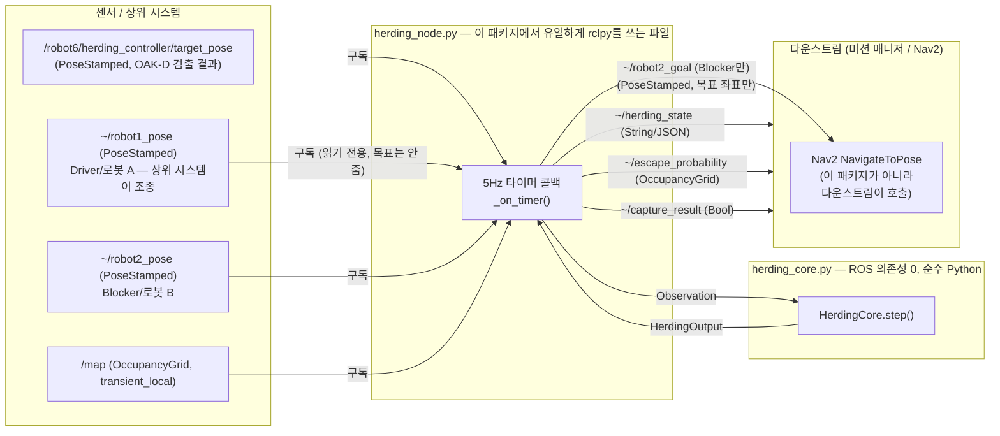
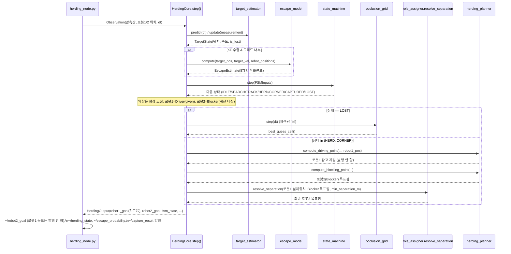
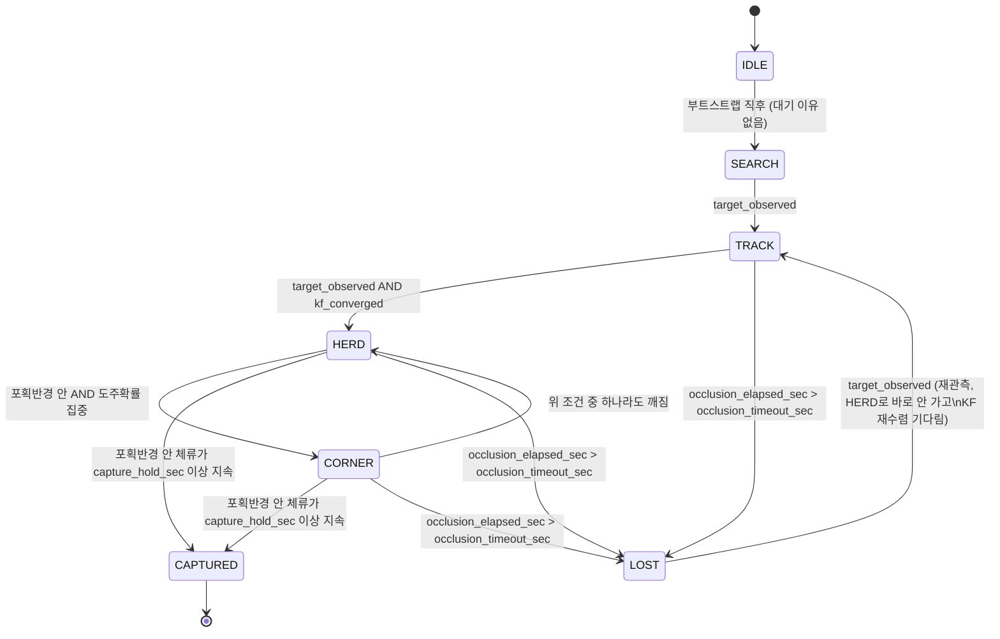

# 코드 리뷰 스터디 가이드 — `herding_controller`

> **이 문서의 목적**: 팀 코드 리뷰에서 발표자가 "이 알고리즘이 왜 이렇게 동작하는가"를
> 자기 말로 설명할 수 있도록 준비하는 자료입니다. PPT 대신 이 문서 + 실제 코드 +
> `code_walkthrough.md`(파일별 색인)를 함께 펼쳐 놓고 리뷰를 진행하면 됩니다.
>
> 읽는 순서 추천: **1 → 2 → 3(설계도) → 4(코드) → 5(테스트) → 6(Nav2) → 7(Q&A)**.
> 이 순서는 Code Review 안내의 "설계도 → 코드 → 테스트결과 → Q&A" 발표 순서와 동일합니다.

---

## 1. 한 줄 요약

**"로봇이 표적을 직접 붙잡는 게 아니라, 표적이 로봇을 피해 도망치는 반응 자체를
역이용해서 원하는 방향(포획존)으로 유도한다."**

- 로봇 A(**Driver**)는 표적 뒤쪽, 포획존과 정반대 지점에 자리를 잡는다. 표적은
  다가오는 로봇에게서 도망치므로, Driver가 그 자리에 있으면 표적은 자연히
  포획존 쪽으로 밀려난다. **이 패키지는 로봇 A를 조종하지 않는다** — 두
  로봇은 배터리 상태에 따라 번갈아 순찰/충전하고, 순찰 중 표적을 발견한
  로봇이 그 순간 상위 시스템에 의해 Driver로 배정되며(그 배정은 이 패키지
  밖에서 이루어짐), 그 배정은 포획 에피소드가 끝날 때까지 고정된다.
- 로봇 B(**Blocker**)는 표적이 포획존이 아닌 다른 방향으로 새어나갈 것 같은
  경로를 예측해서 미리 막아선다. **이 패키지가 실제로 계산해서 명령하는
  유일한 로봇이 로봇 B다.**
- 지금이 "추적 중"인지 "구석에 몰렸는지"(**상태기계**), 표적을 놓쳤을 때
  어디를 찾아봐야 할지(**재탐색**)를 각각 별도 모듈이 담당하고, 이 전부를
  매 제어 주기(5Hz)마다 순서대로 실행하는 것이 `herding_core.py`의
  `HerdingCore.step()`이다.

---

## 2. 전체 아키텍처 — 메시지 흐름

**핵심 경계선 (2개)**:
1. 이 패키지는 **로봇 2(Blocker)의 목표만** 계산·발행합니다. 로봇 1(Driver)은
   조종하지 않습니다 — `~/robot1_pose`는 구독하지만 `~/robot1_goal`은 아예
   발행하지 않습니다. 그 로봇의 움직임은 상위 시스템(순찰/추격 거동) 책임입니다.
2. `~/robot2_goal`은 **좌표만 발행**하고, Nav2의 `NavigateToPose` 액션은 직접
   호출하지 않습니다(설계 스펙 §3-3 "Nav2 액션 직접 호출 금지"). 실제 주행
   경로 계획과 장애물 회피는 그 목표 좌표를 받는 다운스트림(Nav2 스택)의
   책임입니다 — §6 참고.

---

## 3. 한 제어 주기의 데이터 흐름 (시퀀스)

이 순서가 `herding_core.py`의 `HerdingCore.step()` 함수 본문 순서와 정확히
일치합니다 (코드 리뷰에서 "코드 설명" 단계에 이 다이어그램과 `step()`을
나란히 두고 한 줄씩 매칭하면 됩니다).

---

## 4. 상태기계(FSM) — 몰이 진행 단계

**왜 HERD→CORNER 전이가 위치 조건 + 확률 조건을 둘 다 요구하는가**: 포획반경
안에 있어도 사방으로 도망칠 여지가 있으면 아직 "구석에 몰렸다"고 볼 수
없습니다. `escape_model`이 예측한 확률분포의 최댓값이
`escape_concentration_threshold`(기본 0.5) 이상 — 즉 도주로가 사실상 한
방향으로 좁혀졌을 때만 CORNER로 인정합니다 (`state_machine.py:66-73`).

**왜 재관측 시 HERD가 아니라 TRACK으로 돌아가는가**: LOST 동안 칼만 필터는
관측 없이 `predict()`만 계속 호출되어 불확실성(P)이 계속 커진 상태입니다.
재관측 즉시 HERD로 점프하면 아직 신뢰할 수 없는 속도 추정치로 Driver를
움직이게 되므로, TRACK의 `kf_converged` 게이트를 다시 통과시켜 KF가
재수렴할 시간을 줍니다.

---

## 5. 메시지 인터페이스

| 방향 | 토픽 | 타입 | 발행/구독 주체 | 비고 |
|---|---|---|---|---|
| 구독 | `~/target_pose` | `geometry_msgs/PoseStamped` | Detection 파트 (표적 검출) | 관측 없는 주기에는 발행되지 않음 → `predict()`만 실행됨 |
| 구독 | `~/robot1_pose` | `geometry_msgs/PoseStamped` | AMR 로컬라이제이션 | **Driver(로봇 A)의 실제 위치 — 입력으로만 쓰고 목표는 안 준다.** 순찰 중 표적을 발견한 로봇이 상위 시스템에 의해 이 역할로 배정됨 |
| 구독 | `~/robot2_pose` | `geometry_msgs/PoseStamped` | AMR 로컬라이제이션 | Blocker(로봇 B)의 실제 위치 |
| 구독 | `/map` | `nav_msgs/OccupancyGrid` | SLAM/맵 서버 | QoS `TRANSIENT_LOCAL` (맵은 한 번 발행되고 유지되는 정적 데이터) |
| 발행 안 함 | ~~`~/robot1_goal`~~ | — | — | **로봇 1(Driver)은 이 패키지가 조종하지 않으므로 발행하지 않는다** (2026-08-06 정정) |
| 발행 | `~/robot2_goal` | `geometry_msgs/PoseStamped` | 이 노드 → Nav2 | **이 패키지가 실제로 명령하는 유일한 좌표.** 좌표만 발행, Nav2 액션 직접 호출 안 함 |
| 발행 | `~/herding_state` | `std_msgs/String` (JSON) | 이 노드 → SysMon/로깅 | FSM 상태, driver/blocker id(항상 1/2 고정), 표적 위치/속도, panic 플래그 |
| 발행 | `~/escape_probability` | `nav_msgs/OccupancyGrid` | 이 노드 → RViz 시각화 | 8방향 도주 확률을 그리드에 래스터화 (0~100) |
| 발행 | `~/capture_result` | `std_msgs/Bool` | 이 노드 → SysMon | FSM 상태 == CAPTURED |

제어 주기: **5.0 Hz** (`control_rate_hz` 파라미터).

---

## 6. Nav2 연동 — 이 패키지가 "하지 않는" 일

**AMR 파트는 발표자가 Nav2 API 사용법까지 설명할 수 있어야 한다는 요구사항이
있으므로, 이 경계선을 명확히 이해하고 있어야 합니다.**

- 이 패키지(`herding_controller`)는 Nav2의 `NavigateToPose` 액션 클라이언트가
  **아닙니다**. `~/robot2_goal`(Blocker의 목표) 하나로 목표 좌표(`PoseStamped`)만
  발행하고 끝입니다. 로봇 1(Driver)의 목표는 애초에 발행하지 않습니다 —
  그 로봇은 이 패키지가 조종하지 않기 때문입니다.
- 실제로 그 좌표를 받아 Nav2 액션을 호출하고, 전역/지역 경로 계획, 장애물
  회피, 로컬라이제이션까지 수행하는 것은 **다운스트림의 미션 매니저 노드**의
  책임입니다.
- 이렇게 분리한 이유(설계 제약): `herding_core.py`와 그 하위 7개 모듈이 ROS
  의존성 없이 순수 Python으로 오프라인 검증(`test/run_validation.py`의
  ALGO-001~008)이 가능해야 했기 때문입니다. Nav2 액션 호출까지 이 안에
  넣으면 ROS 환경 없이는 알고리즘 자체를 테스트할 수 없게 됩니다.
- 그래서 이 패키지의 "AMR API 사용"은 **좁습니다**: 어떤 Nav2 API를 이 패키지
  자체가 호출하는 것이 아니라, 이 패키지가 발행하는 좌표를 다운스트림이
  Nav2에 어떻게 넘기는지(NavigateToPose goal pose)를 설명하면 됩니다. Q&A에서
  "왜 Nav2를 직접 호출하지 않았나"라는 질문이 나오면 위 이유를 그대로
  답하면 됩니다.

---

## 7. 설계 ↔ 코드 ↔ 테스트 매칭

| 설계 요소 (`docs/superpowers/specs/2026-08-04-herding-controller-design.md`) | 코드 | 검증 테스트 |
|---|---|---|
| §2-1 Driving Point 공식 | `herding_planner.py: compute_driving_point()` | `test/test_herding_planner.py`, ALGO-002 |
| §2-2 Blocking Point 4단계 알고리즘 | `herding_planner.py: compute_blocking_point()` | `test/test_herding_planner.py`, ALGO-003 |
| §2-5 최소 이격 거리 (2026-08-06 정정) | `role_assigner.py: resolve_separation()` | `test/test_role_assigner.py`, ALGO-004(항상 0회 스왑 → 구조적 PASS) |
| §2-4 FSM 다이어그램 | `state_machine.py: HerdingStateMachine.step()` | `test/test_state_machine.py`, ALGO-001 |
| §3-3 메시지 인터페이스 (2026-08-06 정정) | `herding_node.py` 구독/발행부 | `test/test_herding_node.py` (mock rclpy) |
| (칼만 필터, 스펙 §2 배경) | `target_estimator.py: TargetEstimator` | `test/test_target_estimator.py` |
| (마르코프 도주 모델, 스펙 §2 배경) | `escape_model.py: EscapeModel.compute()` | `test/test_escape_model.py`, ALGO-005 |
| (LOST 재탐색, 스펙 §2 배경) | `occlusion_grid.py: OcclusionGrid` | `test/test_occlusion_grid.py`, ALGO-006 (역할 고정 + 발견기반 스폰 재검증 후 100%, PASS) |
| (벽 인지 목표 방향, 2026-08-06 신규 — 스펙에 없음) | `geodesic_field.py: GeodesicField` | 별도 단위 테스트 없음(순수 계산 모듈); `run_real_map_algo_suite`로 통합 검증 |
| 전체 통합 (추상 아레나, 회귀용) | `herding_core.py: HerdingCore.step()` | `test/simulator.py: run_trial()` + `run_validation.py: run_algo_suite()` (ALGO-001~008 전체, 8/8 PASS) |
| **전체 통합 (실제 맵, 정식 — 2026-08-06)** | `herding_core.py: HerdingCore.step()` | `test/simulator.py: run_trial_real_map()` + `run_validation.py: run_real_map_algo_suite()` (트랩 3곳 × ALGO-001/002/003/005, 4/4 PASS) |

> 정식 코드에는 없지만 참고: `herding_controller/experiments/`의 실험 스크립트는
> 위 정식 모듈을 재사용해 실제 SLAM 맵 위에서 2로봇 시나리오를 GIF로
> 시각화하는 용도로 남아 있습니다 (코드 리뷰의 "코드" 항목에는 포함되지
> 않지만 "테스트 자료"의 시각 자료로 활용 가능). 다만 실제 맵/geodesic
> 필드 자체는 2026-08-06부로 각각 `maps/`와 `herding_controller/geodesic_field.py`로
> 승격되어 정식 코드의 일부가 됐고, 실제 맵 기준 통계 검증은 이제
> `experiments/`가 아니라 `test/real_map_arena.py` + `run_validation.py:
> run_real_map_algo_suite()`가 정식으로 담당합니다.

---

## 8. 모듈별 발표 대본 (구두 설명용 핵심 문장)

리뷰에서 "이 부분은 뭘 하는 코드냐"는 질문에 아래 한두 문장으로 먼저 답하고,
필요하면 코드의 상세 주석(각 파일에 직접 추가됨)을 짚어 보여주는 방식을 권장합니다.

1. **`grid_map.py`** — "모든 모듈이 '이 좌표가 벽인가'를 판단할 때 거치는
   단일 진실 공급원입니다. 미터 좌표와 격자 셀 인덱스를 서로 변환합니다."
2. **`target_estimator.py`** — "표적의 위치를 등속도 칼만 필터로 추적합니다.
   센서는 위치만 주지만, 필터는 위치 변화로부터 속도까지 함께 추정해서
   도주 방향 예측과 '이미 목표 쪽으로 가고 있는지' 판단에 씁니다."
3. **`escape_model.py`** — "표적이 다음에 어느 방향으로 도망칠지 8방향 확률로
   예측합니다. 벽을 따라 도망치는 습성, 로봇으로부터의 반발, 관성 세 요인을
   더해서 계산합니다."
4. **`herding_planner.py`** — "이 예측을 실제 로봇의 목표 좌표로 바꾸는
   곳입니다. Driver는 표적 뒤쪽에, Blocker는 예측된 도주로 중 가장
   유력한 곳을 선점합니다."
5. **`role_assigner.py`** — "Driver/Blocker 역할은 이 코드가 정하지 않습니다.
   순찰 중 표적을 발견한 로봇이 그 순간 상위 시스템에 의해 Driver로
   배정되고 에피소드가 끝날 때까지 고정됩니다. 이 파일이 실제로 하는
   일은 Blocker의 목표점이 Driver의 실제 위치와 너무 가까워지지 않게
   최소 이격 거리만 유지시키는 것뿐입니다."
6. **`state_machine.py`** — "몰이의 진행 단계(탐색→추적→몰이→구석몰이→포획)를
   관리합니다. 관측이 끊기면 어떤 상태에서도 즉시 LOST로 빠지는 안전
   조건이 별도로 걸려 있습니다."
7. **`occlusion_grid.py`** — "표적을 놓쳤을 때(LOST) '어디 있을 가능성이
   가장 높은가'를 시간에 따라 흐려지는 확률 지도로 추적해서 재탐색
   목표를 줍니다."
8. **`herding_core.py`** — "위 7개 모듈을 매 제어 주기마다 올바른 순서로
   호출하는 오케스트레이션 파사드입니다. ROS 의존성이 전혀 없어서 이
   전체를 ROS 없이도 통계적으로 검증할 수 있었습니다."
9. **`herding_node.py`** — "순수 로직과 ROS 세계를 잇는 유일한 지점입니다.
   여기엔 알고리즘 로직이 없고, 전부 `HerdingCore`에 위임만 합니다."

---

## 9. 예상 Q&A

**Q. 왜 로봇이 표적을 직접 미느냐, 왜 도주 반응을 이용하는 방식을 택했나?**
A. 실제 로봇이 물리적으로 표적을 접촉해서 미는 것은 안전/제어상 훨씬
어렵습니다. 표적의 자연스러운 회피 행동을 전제로, 로봇은 "표적이 도망칠
방향"만 계산해서 그 반대편에 서는 것으로 충분히 몰이가 가능합니다.

**Q. Driver와 Blocker는 고정 역할인가?**
A. 로봇 개체로 보면 고정이 아니고(오늘은 A였던 로봇이 다음 임무에서 B가
될 수 있음), 하나의 포획 에피소드 안에서는 고정입니다. 두 로봇이 배터리에
따라 번갈아 순찰/충전하다가, 순찰 중 표적을 발견한 로봇이 그 순간 Driver로
배정되고 그 배정은 포획이 끝날 때까지 유지됩니다. 이 배정은 상위
시스템이 하고, 이 패키지는 그 결과를 given으로 받아 Blocker(나머지 로봇)의
목표점만 계산합니다 — 비용을 비교해서 매 주기 재배정하는 로직은 없습니다.

**Q. 이 패키지가 로봇 1(Driver)의 목표도 계산하나?**
A. 계산은 하지만(`compute_driving_point()`) **발행하지 않습니다.** 그 값은
"외부 시스템이 근사할 것으로 기대되는 거동"의 참고치이자, 오프라인 검증
하네스가 로봇 1을 움직이는 데 재사용하는 모델일 뿐입니다. 실제로 로봇에
명령이 나가는 건 `~/robot2_goal`(Blocker) 하나뿐입니다.

**Q. 표적을 놓치면(카메라 시야 이탈 등) 어떻게 되나?**
A. `occlusion_timeout_sec` 이상 관측이 끊기면 FSM이 LOST로 전이하고,
`occlusion_grid.py`의 belief 그리드가 마지막 위치에서 확산·감쇠하며
"있을 법한 위치"를 추적합니다. 로봇 2(Blocker)는 그 최고 확률 지점으로
재탐색을 갑니다(로봇 1(Driver)에게는 참고 지점만 계산되고 실제로 명령이
나가지 않는 건 다른 상태와 동일). 초기 검증(역할 동적 재배정 가정 하)에서는
목표 80%에 못 미치는 79.3%로 나와 한계로 기록됐었지만, 역할을 고정하고
검증 하네스의 스폰 방식을 "발견 위치 근처에서 시작"으로 바로잡은 뒤
재검증한 결과 100%로 나왔습니다(트러블슈팅 노트 10번 항목 참고) — 다만
표본이 커진 재현 검증은 아직 필요합니다.

**Q. Nav2와는 어떻게 연동되나?**
A. 이 패키지는 Blocker의 목표 좌표(`~/robot2_goal`) 하나만 발행하고,
Nav2의 `NavigateToPose` 액션 호출과 실제 경로 계획/장애물 회피는
다운스트림 미션 매니저가 담당합니다. §6 참고.

**Q. 왜 ROS 의존성을 이렇게 철저히 분리했나?**
A. 실제 로봇/Nav2 스택 없이도 알고리즘 자체의 성공률을 통계적으로
검증(`test/run_validation.py`의 ALGO-001~008, 다회 시행 + 카이제곱
대조군 실험)해야 했기 때문입니다. `herding_node.py`만 rclpy를 쓰고,
그 아래 로직은 순수 numpy/Python이라 pytest만으로 수백 회 시행을 빠르게
돌릴 수 있었습니다.

**Q. 포획 판정은 어떻게 하나? 표적이 반경 근처만 스쳐도 성공으로 잡히지 않나?**
A. 단순히 반경 안에 들어온 순간이 아니라, `capture_hold_sec`(연속 체류
시간, 현재 1.5초) 이상 반경(`capture_radius_m`, 0.3m) 안에 머물러야
**그리고 동시에** 도주확률이 한쪽으로 집중돼 있어야 CAPTURED로
판정합니다(`state_machine.py`의 포획 유지 타이머 + `escape_prob_concentrated`
게이트, 둘 다 필요). `capture_hold_sec`은 원래 3.0초였는데, 실제 방에서
표적이 반경 경계를 자연스럽게 들락거리는 진동 때문에 3초 연속을 못 채우는
경우가 대부분이라 1.5초로 낮췄습니다 — 여전히 "스쳐 지나가면 끝"이 아니라
실제 체류를 요구하는 값입니다 (트러블슈팅 노트 10-4 항목에 이 과정 전체가
기록돼 있습니다).

**Q. 역할을 고정한 뒤 실제 맵 성공률이 얼마나 나오나?**
A. 최종적으로(N=100/트랩) `reactive_flee` **65.0%**(주 트랩 "top" 단독
75.0%), `noisy_human` **87.0%**(주 트랩 단독 94.0%)입니다. 실제 맵 기준
ALGO-001/002/003/005 4개 게이트 전부 PASS이고, 추상 아레나 회귀
검증(ALGO-001~008)도 8개 전부 PASS입니다.

다만 이 숫자에 도달하기까지 우여곡절이 있었습니다 — 검증 하네스와 파라미터
튜닝이 전부 "벽 없는 10×10m 아레나" 가정 위에 있었는데, 실제 맵으로
바꾸면서 그 가정이 하나씩 깨졌기 때문입니다: (1) 로봇 1 스폰 위치를
"발견한 곳 근처"로 바꾸니 62%→78% 회복, (2) 표적이 벽 앞에서 완전히
얼어붙던 버그를 고치니(더 현실적인 동작) 오히려 0%로 떨어짐 — 얼어붙는 게
로봇에게 유리하게 작용하고 있었다는 뜻, (3) `panic_distance_m` 등 거리
파라미터를 방 크기(5.3×7.35m)에 맞게 재스윕해서 패닉률을 정상화, (4)
그런데도 포획이 안 돼서 원인을 추적해보니 표적은 트랩에 거의 정확히
도달하고 있었고(최근접 거리 0~0.02m가 흔함) 3초 연속 체류 조건만 걸림돌
이었음 → `capture_hold_sec`을 1.5초로 낮춰서 최종 65~87% 달성. 전체
과정은 트러블슈팅 노트 10번 항목에 정리돼 있습니다 — 리뷰에서 "숫자가 왜
이렇게 여러 번 바뀌었냐"는 질문이 나오면 이 여정 자체가 답입니다: 버그처럼
보이는 게 실은 성공률을 부풀리고 있었을 수 있다는 것, 그리고 맵을 바꾸면
파라미터도 그 크기에 맞게 다시 스윕해야 한다는 것.

---

## 10. 참고 문서

- [설계 스펙](../../docs/superpowers/specs/2026-08-04-herding-controller-design.md) — 원본 함수 흐름/메시지 인터페이스 텍스트
- [코드 워크스루](code_walkthrough.md) — 파일별 클래스/함수 색인
- [최종 검증 리포트](../../docs/superpowers/plans/2026-08-04-herding-controller-final-report.md) — ALGO-001~008 수치 결과
- [트러블슈팅 노트](../../herding_controller_트러블슈팅_노트.md) — 실패 사례, 파라미터 튜닝 히스토리, GIF 도구 개발기
