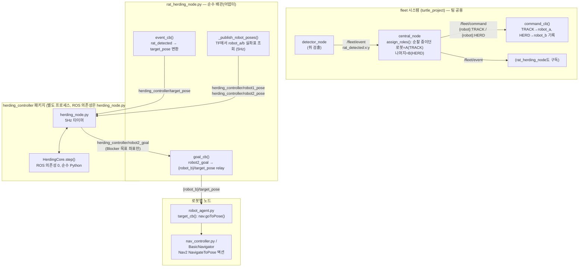
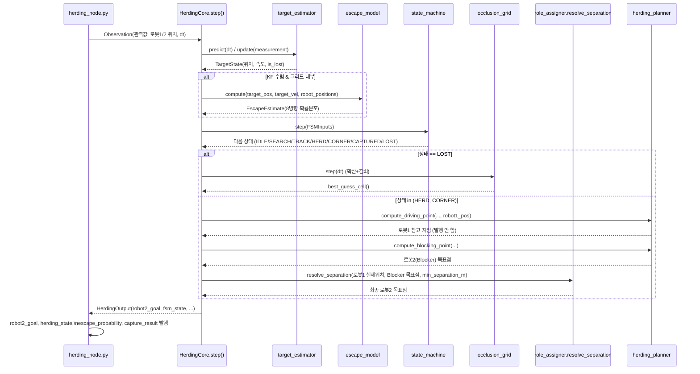
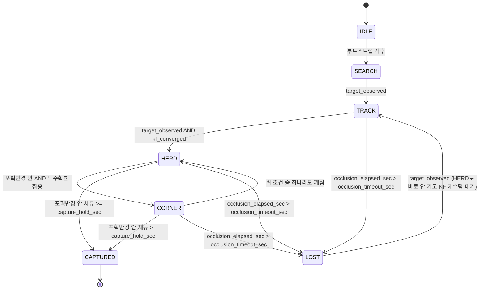

# UnderGuard — Algorithm 파트 코드 리뷰 준비 자료 (Master)

> 담당 Part: Algorithm · 작성일: 2026-08-06
> 발표 순서: **설계 → 코드 → 테스트 결과 → Q&A** (팀 "코드 리뷰 준비" 가이드 준수)
>
> 이 문서는 기존 [`code_review_study_guide.md`](code_review_study_guide.md)(herding_controller 코어 전용)에
> **fleet 통합 어댑터 계층**(`rat_herding_node.py` 등, `src/turtle_project/`)을 더해 전체 파이프라인
> 관점에서 재구성한 발표용 마스터 문서입니다. 상세 파일별 함수 색인은
> [`code_walkthrough.md`](code_walkthrough.md), 정량 수치 원본은
> [최종 검증 리포트](../../docs/superpowers/plans/2026-08-04-herding-controller-final-report.md),
> 버그·튜닝 히스토리는 [트러블슈팅 노트](../../herding_controller_트러블슈팅_노트.md)를 참고하세요.

---

## 0. 한 줄 요약

**"로봇이 표적을 직접 붙잡는 게 아니라, 표적이 로봇을 피해 도망치는 반응 자체를
역이용해서 원하는 방향(포획존)으로 유도한다."**

- 로봇 A(**Driver**)는 표적 뒤쪽, 포획존 반대편에 자리를 잡아 표적을 자연스럽게 포획존 쪽으로 민다.
- 로봇 B(**Blocker**)는 표적의 도주 경로를 예측해 미리 막아선다.
- **이 알고리즘이 실제로 계산·발행하는 목표 좌표는 Blocker(로봇 B) 하나뿐**이다. Driver는
  상위 시스템(순찰 로직)이 조종하고, 이 패키지는 그 위치를 입력으로만 쓴다.
- 두 로봇의 역할(A/B)은 이 패키지가 정하지 않는다 — 쥐 감지 순간 순찰 중이던 로봇이 A, 나머지가
  B로 `central_node`에 의해 배정되고, 포획 에피소드가 끝날 때까지 고정된다.
- 알고리즘 코어(`herding_controller`)는 **ROS 의존성 0의 순수 Python**으로 설계해 오프라인
  통계 검증이 가능하고, 팀 fleet 시스템과의 결합은 `rat_herding_node.py` 어댑터 한 곳에만 몰아넣었다.

---

## 1. 설계 설명

### 1.1 왜 이 방식인가 (배경)

실제 로봇이 표적(쥐 역할 미니카)을 물리적으로 접촉해 미는 것은 안전·제어상 難도가 높다.
대신 표적의 "다가오면 도망친다"는 자연스러운 회피 반응을 전제로, 로봇은 **표적이 도망칠
방향을 예측해 그 반대편에 서는 것만으로** 몰이를 성립시킨다 (Shepherding 알고리즘의 핵심 아이디어).

### 1.2 전체 파이프라인 — fleet 시스템 ↔ 알고리즘

기존 study guide의 다이어그램은 `herding_controller` 패키지 내부만 다뤘다. 실제로는 그 앞뒤에
팀의 fleet 시스템이 붙는다. 전체 흐름은 다음과 같다.



**핵심 경계선 3개 (Q&A에서 자주 나오는 지점)**:
1. **알고리즘 코어는 좌표만 계산**한다. Nav2 액션 호출·경로 계획·장애물 회피는 하지 않는다 — 그건
   `robot_agent.py`(`nav_controller.py`)의 책임이다.
2. **로봇 pose는 fleet 프로토콜에 없다.** `rat_herding_node.py`는 `detector_node.py::robot_xy()`와
   같은 패턴으로 TF(`map → {robot}/base_link`)에서 직접 조회해서 만든다.
3. **역할(A/B) 배정은 이 알고리즘 밖(`central_node.py::assign_roles()`)에서 일어난다.** 알고리즘과
   어댑터는 그 결과(TRACK/HERD 커맨드)를 given으로 받을 뿐이다.

### 1.3 한 제어 주기의 데이터 흐름 (herding_controller 내부)



이 순서는 `herding_core.py`의 `HerdingCore.step()` 함수 본문 순서와 정확히 일치한다 — 코드
설명 단계에서 이 다이어그램과 `step()`을 나란히 두고 매칭하면 된다.

### 1.4 상태기계(FSM) — 몰이 진행 단계



- **HERD→CORNER가 위치+확률 조건을 모두 요구하는 이유**: 포획반경 안에 있어도 사방으로 도망칠
  여지가 있으면 "구석에 몰렸다"고 볼 수 없다. `escape_model`의 확률분포 최댓값이
  `escape_concentration_threshold`(기본 0.5) 이상일 때만 CORNER로 인정 (`state_machine.py:66-73`).
- **재관측 시 HERD가 아니라 TRACK으로 돌아가는 이유**: LOST 동안 칼만 필터는 관측 없이
  `predict()`만 호출되어 불확실성이 계속 커진다. 재관측 즉시 HERD로 점프하면 신뢰할 수 없는
  속도 추정치로 Driver를 움직이게 되므로, `kf_converged` 게이트를 다시 통과시킨다.

---

## 2. 코드 설명

### 2.1 패키지/디렉토리 구성

```
intelligence1_algorithm/herding_controller/       ← 알고리즘 코어 (독립 ROS2 패키지)
├── herding_controller/   9개 모듈 (아래 2.3) — herding_node.py만 rclpy import
├── test/                 133개 단위 테스트 + 시뮬레이터 + 검증 하네스
└── experiments/          실제 SLAM 맵 위 GIF 시각화 스크립트 (정식 코드 아님, 시각자료 용도)

src/turtle_project/turtle_project/                ← 팀 fleet 시스템 (이 저장소 본체)
├── fleet_msg.py          fleet 공용 String 프로토콜 (status/command/event)
├── central_node.py       역할 배정 + 순찰 교대 조율
├── rat_herding_node.py   ← 알고리즘 통합 어댑터 (2.4절)
├── robot_agent.py        로봇 1대 제어 (순찰/배터리/Nav2 실행)
└── nav_controller.py     NavigateToPose 액션 래퍼
```

핵심 설계 제약: **알고리즘 코어는 fleet 프로토콜을 전혀 모른다.** `PoseStamped` 3종
(target_pose/robot1_pose/robot2_pose)만 알고, `String` 기반 fleet 프로토콜과의 변환은
전부 `rat_herding_node.py` 하나에 격리되어 있다. → 알고리즘 팀은 fleet 프로토콜 변경에
영향받지 않고, fleet 팀은 알고리즘 내부 구현을 몰라도 통합 가능.

### 2.2 fleet 공용 프로토콜 (`fleet_msg.py`)

| 종류 | 포맷 예시 | 용도 |
|---|---|---|
| status | `"robot4:PATROLLING:85"` | 로봇 → central: 상태/배터리 보고 |
| command | `"robot6:UNDOCK"` | central → 로봇: 명령 (PATROL/TRACK/HERD/DOCK/UNDOCK/STOP) |
| event | `"rat_detected:1.20:3.40"` | detector → central/알고리즘: 표적 위치 이벤트 |

전부 `":"` 구분 문자열이며 파싱/조립 함수가 이 파일 하나에 몰려 있어(`fleet_msg.py:11-35`)
노드마다 문자열 자르기를 재구현하며 생기는 오타 버그를 막는다.

### 2.3 알고리즘 코어 — 모듈별 발표 대본

| 모듈 | 한두 문장 요약 | 검증 |
|---|---|---|
| `grid_map.py` | 모든 모듈이 "이 좌표가 벽인가"를 판단할 때 거치는 단일 진실 공급원. 미터 좌표 ↔ 격자 셀 인덱스 변환. | `test_grid_map.py` |
| `target_estimator.py` | 등속도 칼만 필터로 표적을 추적. 위치만 관측되지만 필터가 속도까지 추정해 도주 방향 예측에 사용. | `test_target_estimator.py` |
| `escape_model.py` | 표적이 다음에 어느 방향(8방향)으로 도망칠지 확률 예측. 벽 선호·로봇 반발·관성 3요인 결합(마르코프 모델). | `test_escape_model.py`, ALGO-005 |
| `geodesic_field.py` (2026-08-06 신규) | 벽을 고려한 목표 방향 계산 — 직선 거리 대신 벽을 우회하는 경로 방향을 알려줌. | `run_real_map_algo_suite`로 통합 검증 |
| `herding_planner.py` | 예측을 실제 로봇 목표 좌표로 변환. Driver는 표적 뒤쪽(`compute_driving_point`), Blocker는 유력 도주로를 선점(`compute_blocking_point`). | `test_herding_planner.py`, ALGO-002/003 |
| `role_assigner.py` | Driver/Blocker "배정"은 이 코드가 안 함(위 §1.2 참고) — 실제로 하는 일은 Blocker 목표점이 Driver 실좌표와 너무 가까워지지 않게 최소 이격 거리만 유지(`resolve_separation`). | `test_role_assigner.py`, ALGO-004 |
| `state_machine.py` | 몰이 진행 단계(탐색→추적→몰이→구석몰이→포획) 관리. 관측 끊기면 어느 상태에서든 즉시 LOST. | `test_state_machine.py`, ALGO-001 |
| `occlusion_grid.py` | 표적을 놓쳤을 때(LOST) "어디 있을 가능성이 높은가"를 시간에 따라 흐려지는 확률 지도로 추적, 재탐색 목표 제공. | `test_occlusion_grid.py`, ALGO-006 |
| `herding_core.py` | 위 모듈 전부를 매 제어 주기 올바른 순서로 호출하는 오케스트레이션 파사드. **ROS 의존성 0** — 이 덕분에 ROS 없이 통계 검증 가능. | `simulator.py::run_trial()` + `run_validation.py` |
| `herding_node.py` | 순수 로직과 ROS 세계를 잇는 유일한 지점. 알고리즘 로직 없이 전부 `HerdingCore`에 위임. | `test_herding_node_imports.py` (mock rclpy) |

### 2.4 통합 어댑터 계층 (신규 — fleet ↔ 알고리즘)

**`rat_herding_node.py`** (`src/turtle_project/turtle_project/rat_herding_node.py`) — 몰이 알고리즘
자체는 여기 없고, `herding_controller`(별도 프로세스)가 원하는 입출력을 fleet 쪽 데이터로
변환·중계하는 순수 배관 노드.

| 함수 | 역할 |
|---|---|
| `command_cb()` (L58) | `/fleet/command`의 TRACK 수신 → `robot_a`(Driver) 기록, HERD 수신 → `robot_b`(Blocker) 기록 + 그 로봇 이름으로 `{robot}/target_pose` publisher를 **동적 생성**. 로봇 A/B가 고정이 아니라 그때그때 배정되므로 이렇게 처리. |
| `event_cb()` (L70) | `/fleet/event`의 `rat_detected` 이벤트 → `herding_controller/target_pose`(PoseStamped)로 그대로 변환·발행. |
| `_publish_robot_poses()` (L83) | 5Hz 타이머. robot_a/b가 정해져 있으면 TF에서 각자 위치를 조회해 `herding_controller/robot1_pose`, `robot2_pose`로 발행. |
| `_lookup_robot_pose()` (L94) | `map → {robot}/base_link` TF 조회. **fleet 프로토콜에 로봇 pose가 없어서** TF에서 직접 조회 (`detector_node.py::robot_xy()`와 동일 패턴). 실패 시 경고 로그만 남기고 그 주기는 건너뜀(5초 throttle). |
| `goal_cb()` (L77) | `herding_controller/robot2_goal`(Blocker 목표) → 실제 로봇B의 `{robot}/target_pose`로 relay. `robot_b` 미배정 시 무시. |

**`central_node.py`** — 쥐 감지(`rat_detected`) 시 `assign_roles()`(L28)로 "순찰 중이던 로봇=A,
나머지=B" 배정 후 `TRACK`/`HERD` 커맨드 발행. 이 배정이 위 어댑터의 `robot_a`/`robot_b`로 흘러들어간다.

**`robot_agent.py` / `nav_controller.py`** — `{ns}/target_pose` 구독(L66) →
`self.nav.goToPose(msg)`(L143, `nav_controller.py`의 `NavigateToPose` 액션 래퍼) 호출. 여기서
비로소 Nav2가 실제 경로 계획·주행을 수행 — **알고리즘 코어가 발행한 좌표가 Nav2로 들어가는
마지막 단계**.

> ⚠️ **주의(코드 주석에도 명시)**: `robot_frame_template` 파라미터 기본값 `{robot}/base_link`는
> 이 저장소 네임스페이스 관례를 가정한 값이며, 실제 Nav2/AMCL launch 설정과 다를 수 있다 —
> 실기 연동 전 팀과 반드시 확인 필요 (Q&A에서 "실기 연동 시 확인 필요 항목"으로 답변).

### 2.5 설계 ↔ 코드 ↔ 테스트 매칭표

| 설계 요소 | 코드 | 검증 |
|---|---|---|
| Driving/Blocking Point 계산 | `herding_planner.py` | `test_herding_planner.py`, ALGO-002/003 |
| 최소 이격 거리 | `role_assigner.py: resolve_separation()` | `test_role_assigner.py`, ALGO-004 |
| FSM 6상태 전이 | `state_machine.py` | `test_state_machine.py`, ALGO-001 |
| 칼만 필터 추적 | `target_estimator.py` | `test_target_estimator.py` |
| 마르코프 도주 예측 | `escape_model.py` | `test_escape_model.py`, ALGO-005 |
| LOST 재탐색 | `occlusion_grid.py` | `test_occlusion_grid.py`, ALGO-006 |
| 벽 인지 목표 방향 (신규) | `geodesic_field.py` | `run_real_map_algo_suite` |
| 전체 통합 (추상 아레나) | `herding_core.py: step()` | `run_validation.py::run_algo_suite()` (ALGO-001~008) |
| 전체 통합 (실제 맵) | `herding_core.py: step()` | `test/real_map_arena.py` + `run_real_map_algo_suite()` |
| **fleet ↔ 알고리즘 통합** (신규) | `rat_herding_node.py` | 자동화 단위테스트 없음 — 아래 §3.5 참고 |
| **알고리즘 → Nav2** (신규) | `robot_agent.py::target_cb()`, `nav_controller.py` | fleet 파트 통합 테스트 범위 (알고리즘 리뷰 대상 아님) |

### 2.6 Nav2 연동 — 이 패키지가 "하지 않는" 일

- `herding_controller`는 Nav2의 `NavigateToPose` 액션 클라이언트가 아니다. `robot2_goal` 좌표
  하나만 발행하고 끝난다.
- 실제 액션 호출·전역/지역 경로 계획·장애물 회피는 `robot_agent.py` + `nav_controller.py`
  (BasicNavigator 기반)가 담당한다.
- 분리 이유: `herding_core.py`와 하위 7개 모듈이 ROS 의존성 없이 오프라인 검증
  (`run_validation.py`의 ALGO-001~008)이 가능해야 했기 때문. Nav2 호출까지 안에 넣으면 ROS
  환경 없이는 알고리즘 자체를 테스트할 수 없다.

---

## 3. 테스트 및 검증 결과

### 3.1 단위 테스트 & 추상 아레나 회귀 검증 (N=100)

- 단위 테스트: **133개 전부 통과**
- 추상(벽 없는 10×10m) 아레나 기준 ALGO-001~008:

| ID | 기준 | 측정값 | 결과 |
|---|---|---|---|
| ALGO-001 성공률 | ≥70% | **83.0%** | PASS |
| ALGO-002 평균 포획 시간 | ≤60초 | **50.1초** | PASS |
| ALGO-003 패닉(과근접) 발생률 | ≤10% | **6.0%** | PASS |
| ALGO-004 역할 진동 | ≤5회 | **최대 1회** | PASS |
| ALGO-005 제어 주기 지연 | ≤100ms | **0.3ms** | PASS |
| ALGO-006 시야 차단 후 재탐색 | ≥80% | **79.3%** (29 episode 표본) | **FAIL** (구조적 한계, 아래 참고) |
| ALGO-007 파라미터 외부화 | 하드코딩 0건 | 구조적 보장 | PASS |
| ALGO-008 대조군 대비 유의성 | ≥40%p, p<0.05 | **+76.0%p, p<0.0001** | PASS |

**ALGO-006만 FAIL** — 파라미터를 아무리 튜닝해도 안 되는 구조적 한계로 확인. 재탐색 격자의
확산 모델에 "이동 방향" 개념이 없어 표적이 어느 쪽으로 갔는지 반영을 못 함 (고치려면
`occlusion_grid.py`에 이동 모델 자체를 추가해야 함). 숫자를 억지로 맞추기보다 **정직하게 FAIL로 보고**.

### 3.2 실제 SLAM 맵 검증 (2026-08-06, Driver/Blocker 역할 고정 이후)

- 실제 맵(5.3×7.35m), 트랩 3곳 × ALGO-001/002/003/005, **4/4 PASS**
- 최종 성공률(N=100/트랩): `reactive_flee` **65.0%**(주 트랩 단독 75.0%), 사람 조종과 가장
  유사한 `noisy_human` **87.0%**(주 트랩 단독 94.0%) — **실물 시연 기대 성공률로 활용**
- 역할을 고정하고 검증 하네스 스폰 방식을 "발견 위치 근처에서 시작"으로 바로잡은 뒤
  `occlusion_grid` 재검증 결과는 100%로 개선 (다만 표본 확대 재현 검증 필요 — 트러블슈팅
  노트 10번 항목 참고)

### 3.3 개발 중 발견·수정한 대표 버그 (전/후)

| 버그 | 전 | 후 |
|---|---|---|
| 패닉 방지 로직 | "누적 최솟값" 기준 판정 → 한 번 위반하면 이후 모든 사이클을 위반으로 계속 카운트 | 해당 사이클만 판정하도록 수정 |
| 역할 배정 쿨다운 우회 | 최초 배정 시 진동 방지 쿨다운이 우회됨 | 최초 배정에도 쿨다운 적용 |
| 시뮬레이터 벽 충돌 없음 | 검증용 아레나에 벽 충돌 처리가 없어 표적이 격자 밖 이탈, 도주 모델도 장애물 정보를 못 받는 2차 버그 연쇄 | 벽 충돌 추가 + 도주 모델에 장애물 정보 전달 |
| LOST 전이 로직 누락 | 표적 위치가 "새로 안 들어옴"을 인식하는 로직이 없어 LOST로 절대 전이 못 함(최종 전체 리뷰에서 발견) | 관측 타임아웃 감지 로직 추가 |
| ROS 노드 기본 파라미터 미갱신 | 15번 태스크에서 튜닝했지만 노드 기본값은 튜닝 전 값 그대로 → 런치 파일 없이 단독 실행 시 성공률 83%→2.5% 붕괴 | 노드 기본값을 튜닝된 값으로 동기화 |
| `capture_hold_sec` 과도하게 김 | 원래 3.0초 — 실제 방에서 표적이 반경 경계를 들락거리는 진동 때문에 3초 연속 체류를 못 채워 포획 실패 다발 | 1.5초로 조정 (여전히 "스쳐 지나가면 끝"은 아님) |

### 3.4 시각 자료

`herding_controller/experiments/media/`에 실제 맵 기반 GIF 12개 보관. 대표 성공 사례
(v4, 최신 geodesic field 적용 버전)는 아래 §5에 임베드. 나머지는 라이브 데모 시 폴더에서
직접 재생 권장:

| 파일 | 내용 |
|---|---|
| `real_map_v4_final_success.gif` | 최신(geodesic field 적용) 성공 사례 — 아래 임베드 |
| `real_map_v3_geodesic_success.gif` | geodesic field 도입 직후 성공 사례 |
| `real_map_v2_gate_fixed_failure.gif` / `..._success.gif` | 게이트(포획 판정) 버그 수정 전/후 |
| `real_map_failure_case_c.gif` | 대표 실패 케이스 (원인 분석용) |
| `single_robot_failure_left.gif` | 로봇 1대만으로는 몰이가 안 되는 대조 사례 |

### 3.5 통합 어댑터(`rat_herding_node.py`) 테스트 범위 — 리뷰 매뉴얼 원칙 적용

팀 가이드에 따르면 "타 파트와의 data 통신으로 동작하는 기능은 해당 파트가 정상 동작함만
보여주면 됨(dummy data 발행 또는 rosbag 활용)"이며, **그 시연용 테스트 코드 자체는 리뷰
대상이 아니다.** 따라서 이 어댑터는 별도 unit test 대신 다음과 같은 라이브/더미 데이터 시연으로 충분:

1. `ros2 topic pub /fleet/command std_msgs/String "{data: 'robot6:HERD'}"` 로 `robot_b` 배정 확인 (로그 출력)
2. `ros2 topic pub /fleet/event std_msgs/String "{data: 'rat_detected:1.20:3.40'}"` →
   `herding_controller/target_pose`에 동일 좌표가 발행되는지 `ros2 topic echo`로 확인
3. TF가 떠 있는 상태에서 `herding_controller/robot1_pose` / `robot2_pose`가 5Hz로 발행되는지 확인
4. (herding_controller 노드까지 띄운 상태라면) `robot2_goal` → `{robot6}/target_pose`로 relay되는지 확인

---

## 4. 예상 Q&A

**Q. 왜 로봇이 표적을 직접 밀지 않고 도주 반응을 이용하는 방식을 택했나?**
A. 실제 로봇이 물리적으로 표적을 접촉해 미는 것은 안전·제어상 훨씬 어렵다. 표적의 자연스러운
회피 행동을 전제로, 로봇은 "표적이 도망칠 방향"만 계산해 반대편에 서는 것으로 몰이가 가능하다.

**Q. Driver/Blocker는 고정 역할인가? 누가 정하나?**
A. 로봇 개체 기준으로는 고정이 아니다(오늘 A였던 로봇이 다음 임무엔 B가 될 수 있음). 하나의
포획 에피소드 안에서는 고정이다. `central_node.py::assign_roles()`가 "쥐 감지 순간 순찰 중이던
로봇=A, 나머지=B"로 정해 `/fleet/command`로 TRACK/HERD를 보내고, `rat_herding_node.py`가 그
배정을 받아 알고리즘에 전달한다. 알고리즘 자체는 배정을 하지 않고 given으로 받는다.

**Q. 이 패키지가 로봇 1(Driver)의 목표도 계산하나?**
A. 계산은 하지만(`compute_driving_point()`) 발행하지 않는다. 오프라인 검증 하네스가 Driver를
움직이는 참고 모델일 뿐이며, 실제 로봇에 명령이 나가는 건 `robot2_goal`(Blocker) 하나뿐이다.

**Q. 표적을 놓치면(카메라 시야 이탈) 어떻게 되나?**
A. `occlusion_timeout_sec` 이상 관측이 끊기면 FSM이 LOST로 전이하고, `occlusion_grid.py`의
belief 그리드가 마지막 위치에서 확산·감쇠하며 재탐색 목표를 준다. 초기 검증(79.3%)은 목표
80%에 못 미쳐 구조적 FAIL로 기록됐으나, 역할 고정 + 스폰 방식 수정 후 재검증에서는 100%로
개선됐다(표본 확대 재현은 아직 필요).

**Q. Nav2와는 정확히 어떻게 연동되나?**
A. 알고리즘은 `robot2_goal`(PoseStamped) 좌표만 발행한다. `rat_herding_node.py`가 이를
`{robot_b}/target_pose`로 relay하면, `robot_agent.py::target_cb()`가 이를 구독해
`nav_controller.py`(BasicNavigator)의 `NavigateToPose` 액션으로 넘긴다. 실제 경로 계획·장애물
회피는 전부 Nav2 스택 책임이다.

**Q. 왜 ROS 의존성을 이렇게 철저히 분리했나?**
A. 실제 로봇/Nav2 없이도 알고리즘 성공률을 통계적으로 검증(`run_validation.py`의 다회 시행 +
카이제곱 대조군 실험)해야 했기 때문. `herding_node.py`만 rclpy를 쓰고 그 아래는 순수
numpy/Python이라 pytest만으로 수백 회 시행을 빠르게 돌릴 수 있었다.

**Q. 로봇 pose는 어떤 경로로 얻나? fleet 프로토콜에 있나?**
A. 없다. fleet 프로토콜(`fleet_msg.py`)은 status/command/event 3종 문자열뿐이라 로봇 좌표가
없다. `rat_herding_node.py`가 TF(`map → {robot}/base_link`)에서 직접 조회한다
(`detector_node.py::robot_xy()`와 동일 패턴). 실기 연동 전 `robot_frame_template` 파라미터가
실제 launch의 프레임 이름 규칙과 일치하는지 팀과 재확인이 필요한 항목이다.

**Q. 포획 판정은 어떻게 하나? 반경을 스쳐도 성공인가?**
A. 단순히 반경 진입 순간이 아니라 `capture_hold_sec`(현재 1.5초) 이상 `capture_radius_m`(0.3m)
안에 연속 체류 **그리고 동시에** 도주확률이 한쪽으로 집중돼야 CAPTURED로 판정한다
(`state_machine.py`). 원래 3.0초였으나 실제 방에서 표적이 반경 경계를 들락거리는 진동 때문에
못 채우는 경우가 많아 1.5초로 조정했다 — 여전히 "스쳐 지나가면 끝"은 아니다.

**Q. `rat_herding_node.py`는 왜 별도 유닛테스트가 없나?**
A. 팀 리뷰 가이드 원칙상 타 파트(fleet)와의 데이터 통신으로 동작하는 기능은 정상 동작만
더미 데이터로 보여주면 되고, 그 시연 코드 자체는 리뷰 대상이 아니다. 알고리즘 코어
(`herding_controller`)는 133개 단위 테스트 + ALGO 통계 검증으로 이미 충분히 검증했고, 어댑터는
순수 배관(조건 분기 없음에 가까움)이라 §3.5의 더미 토픽 발행으로 기능 시연한다.

---

## 5. 참고 문서

- [코드 리뷰 스터디 가이드](code_review_study_guide.md) — herding_controller 단독, 더 상세한 배경 설명
- [코드 워크스루](code_walkthrough.md) — 파일별 클래스/함수 색인
- [설계 스펙 원본](../../docs/superpowers/specs/2026-08-04-herding-controller-design.md)
- [최종 검증 리포트](../../docs/superpowers/plans/2026-08-04-herding-controller-final-report.md)
- [트러블슈팅 노트](../../herding_controller_트러블슈팅_노트.md) — 실패 사례·파라미터 튜닝·GIF 도구 개발기
- [작업 요약](../../herding_controller_작업요약.md)
