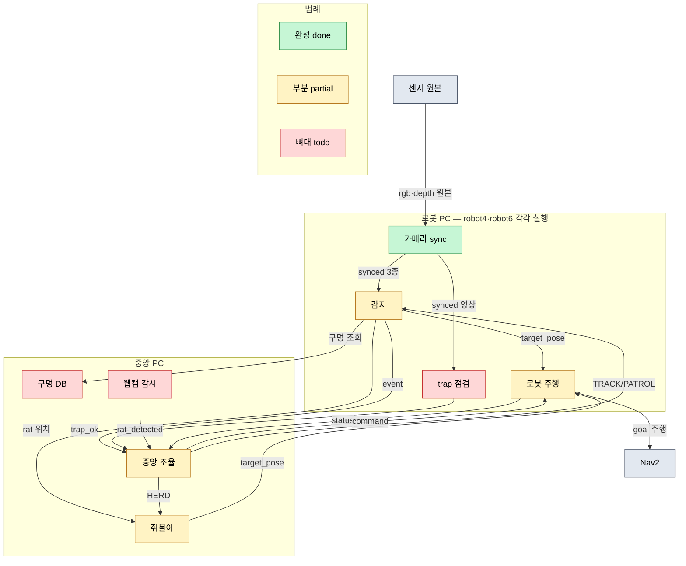

# Under-Guard 아키텍처 — 실제 소스 기준 구현 현황

> 조사 기준: `setup.py` entry_points(9개 노드) → 각 노드 소스 → import된 헬퍼까지
> 실제 코드만 확인. README·주석의 "예정/TODO" 문구는 근거로 쓰지 않고, 코드가
> 실제로 하는 일만 판정했다. (조사일 2026-08-06)

## 1. 데이터 흐름도

**핵심 배선 규칙 (코드 확인)**
- 모든 노드 간 통신은 3개 String 토픽으로만 오간다: `/fleet/status`,
  `/fleet/command`, `/fleet/event` (`fleet_msg.py` 포맷).
- `target_pose`(PoseStamped)는 로봇당 하나로, **detector·쥐몰이가 발행하고
  robot_agent만 구독**한다 = 로봇당 Nav2 주인 1개. (단, 구독측 `target_cb`가
  아직 스텁이라 실제 주행은 안 됨 — 아래 표 참조)
- robot A(추적)/B(몰이)는 고정이 아니라 central이 `TRACK`/`HERD` 명령으로
  런타임 배정. detector·쥐몰이는 그 명령을 보고 자기 역할을 켠다.

## 2. 근거 표

| 노드/기능 | 파일:라인 | 상태 | 판단 근거 (한 줄) |
|-----------|-----------|------|-------------------|
| 카메라 sync | [camera_node.py:43](../turtle_project/camera_node.py#L43) | **done** | cb가 rgb/depth/info 3종을 stamp로 sync 후 그대로 재발행 — 로직 완결 |
| 감지·opening | [detector_node.py:194-315](../turtle_project/detector_node.py#L194-L315) | **done** | `_on_opening→_start_approach→_check_arrival→_verify`가 depth_spread 실제 판정까지 동작 |
| 감지·rat 포획/놓침 | [detector_node.py:154-177](../turtle_project/detector_node.py#L154-L177), [277-285](../turtle_project/detector_node.py#L277-L285) | **done** | RatTracker로 포획/놓침 판정 후 event 발행 (self-check 통과) |
| 감지·rat 추적주행 | [detector_node.py:172](../turtle_project/detector_node.py#L172) | **todo** | 추적 target_pose 발행이 TODO 주석 — 쥐 위치로 접근 안 함 |
| 감지·DB 분기 | [detector_node.py:199-214](../turtle_project/detector_node.py#L199-L214) | **partial** | `_request_db`가 exists 값을 로그만 찍고 분기(기존구멍→점검) 없음 |
| 로봇 주행·순찰 | [robot_agent.py:88-126](../turtle_project/robot_agent.py#L88-L126) | **done** | followWaypoints 무한 순찰 + patrol_tick 재시작 실제 동작 |
| 로봇 주행·배터리 | [robot_agent.py:128-137](../turtle_project/robot_agent.py#L128-L137) | **partial** | 임계 감지·순찰중단은 되나 dock 이동/Dock 액션은 TODO |
| 로봇 주행·target_cb | [robot_agent.py:139-143](../turtle_project/robot_agent.py#L139-L143) | **todo** | 목표 좌표를 로그만 — Nav2 navigate_to_pose 전송이 TODO 스텁 |
| 중앙 조율·전이/배정 | [central_node.py:20-116](../turtle_project/central_node.py#L20-L116) | **done** | next_command·assign_roles·_on_rat·_end_rat 순수로직 (self-check 통과) |
| 중앙 조율·교대시퀀스 | [central_node.py:69](../turtle_project/central_node.py#L69) | **partial** | PATROL 이어받기·재도킹 등 나머지 시퀀스 TODO |
| 중앙 조율·이벤트 | [central_node.py:80](../turtle_project/central_node.py#L80) | **partial** | opening_confirmed/trap_ok 이벤트 미처리 |
| trap 점검 | [trap_check_node.py:30-32](../turtle_project/trap_check_node.py#L30-L32) | **todo** | cb가 `pass` — 판정 로직 없음 (기준 미정) |
| 구멍 DB | [db_node.py:20-25](../turtle_project/db_node.py#L20-L25) | **todo** | query가 항상 `exists=False`, holes 저장/조회 없음 |
| 쥐몰이·B배정 | [rat_herding_node.py:27-34](../turtle_project/rat_herding_node.py#L27-L34) | **done** | command_cb가 HERD 대상을 동적 인식·퍼블리셔 생성 — 동작 |
| 쥐몰이·goal | [rat_herding_node.py:36-44](../turtle_project/rat_herding_node.py#L36-L44) | **todo** | event_cb가 로그만 — 몰이 goal 계산·발행 없음 (알고리즘 미구현) |
| 웹캠 감시 | [webcam_node.py:27-29](../turtle_project/webcam_node.py#L27-L29) | **todo** | tick이 `pass` — VideoCapture/YOLO/homography 없음 |
| fleet_msg | [fleet_msg.py:11-35](../turtle_project/fleet_msg.py#L11-L35) | **done** | status/command/event 조립·파싱 round-trip self-check 통과 |
| depth_math | [depth_math.py:8-76](../turtle_project/depth_math.py#L8-L76) | **done** | decode/deproject/depth_spread 등 self-check 통과 |
| nav_controller | [nav_controller.py:11-31](../turtle_project/nav_controller.py#L11-L31) | **done** | approach_point/make_pose self-check 통과, detector가 실제 사용 (死코드 Navigator 클래스는 삭제함) |
| opening_test_node | [opening_test_node.py](../turtle_project/opening_test_node.py) | **done** | 독립 디버그 툴 — 박스 클릭→depth_spread 판정 완결 동작 |

> 확인 불가/추측 없음 — 모든 항목 소스에서 직접 확인.

## 3. 노드별 요약 (컴퓨터 배치 포함)

| 노드 | 실행 위치 | 종합 상태 |
|------|-----------|-----------|
| camera_node | 각 로봇 PC | 🟢 done |
| detector_node | 각 로봇 PC | 🟡 partial (opening·쥐판정 done / 추적주행·DB·trap todo) |
| trap_check_node | 각 로봇 PC | 🔴 todo (배관만) |
| robot_agent | 각 로봇 PC | 🟡 partial (순찰 done / target_cb·dock todo) |
| central_node | 중앙 PC | 🟡 partial (핵심 조율 done / 교대 잔여·이벤트 todo) |
| db_node | 중앙 PC | 🔴 todo (서비스 껍데기) |
| rat_herding_node | 중앙 PC | 🟡 partial (B배정 done / 몰이 goal todo) |
| webcam_node | 중앙 PC | 🔴 todo (배관만) |

> PC 구성: **내 PC = central + robot4 제어**, **다른 PC = robot6 제어만**.
> discovery-server 네트워킹이라 토픽은 PC 위치와 무관하게 오간다.

## 4. 결론

### 전체 완성도 추정 ~45%

산출 근거 (노드별 대략 가중, 헬퍼 포함):

| 구간 | 추정 | 이유 |
|------|------|------|
| 감지·순찰·조율의 **판정 로직** | ~80% | opening 검증, 쥐 포획/놓침, 역할배정·전이 모두 실제 동작·self-check |
| **실제 주행**(Nav2) | ~10% | robot_agent 순찰만 되고 target_cb(추적/몰이/접근 주행) 미구현 |
| **외부 입력·저장·몰이·trap** | ~10% | webcam/db/rat_herding goal/trap_check 모두 뼈대만 |
| 공용 헬퍼 | 100% | fleet_msg·depth_math·nav_controller 함수 완성 |

→ "머리(판단)"는 상당히 됐고 "손발(실제 goal 주행)"과 "외부 감각기관(웹캠·DB)"이
비어 있는 상태. 8개 노드 단순 평균 ≈ 45%.

### 다음에 손대야 할 미구현 3개 (의존성 순서)

1. **robot_agent `target_cb` — Nav2 navigate_to_pose 전송**
   ([robot_agent.py:139](../turtle_project/robot_agent.py#L139))
   추적·몰이·opening 접근의 **모든 goal 주행이 여기로 모인다.** 이게 스텁인 한
   detector·쥐몰이가 target_pose를 아무리 발행해도 로봇은 안 움직인다. 최우선.
   ⚠️ 단, 이 파일은 사용자 지시로 **Nav2 코드 게이트** 상태 — "코드 짜줘" 전까지 대기.

2. **detector 추적 target_pose 발행**
   ([detector_node.py:172](../turtle_project/detector_node.py#L172))
   #1이 생겨야 의미가 있다. 쥐 포획/놓침 판정은 이미 되므로, 판정한 쥐 위치로
   접근 goal만 쏘면 추적 루프가 닫힌다.

3. **db_node 좌표 저장/근처검색**
   ([db_node.py:20](../turtle_project/db_node.py#L20))
   detector의 DB exists 분기([detector_node.py:199](../turtle_project/detector_node.py#L199))가
   이걸 기다린다. 있어야 "이미 본 구멍이면 재검증 스킵→trap 점검" 경로가 열린다.

> 병렬 가능(팀원 몫, 의존성 낮음): webcam_node(쥐 최초 트리거), rat_herding
> 몰이 알고리즘, trap_check 판정. 위 3개와 독립적으로 진행 가능.
