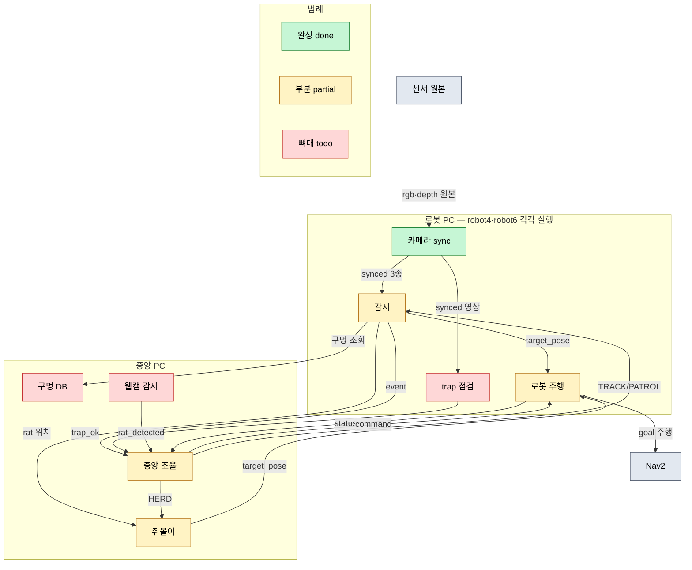

# Under-Guard 데이터 흐름도

## 통신 규칙

- 노드 간 통신은 String 토픽 3개: `/fleet/status`, `/fleet/command`, `/fleet/event`
- `target_pose`(PoseStamped): **detector·쥐몰이가 발행 → robot_agent만 구독** (로봇당 Nav2 주인 1개)
- robot A(추적)/B(몰이)는 고정 아님 — central이 `TRACK`/`HERD` 명령으로 런타임 배정
