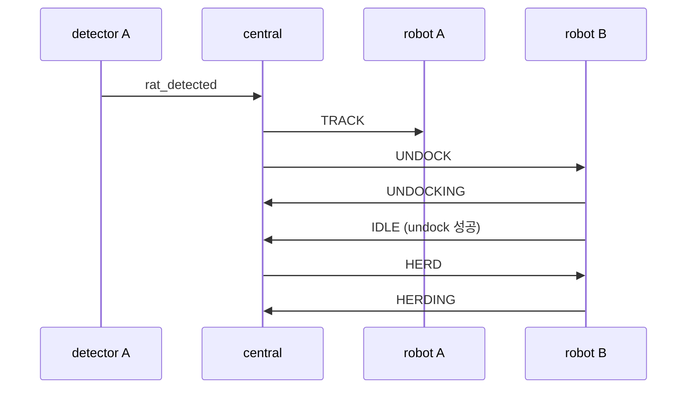
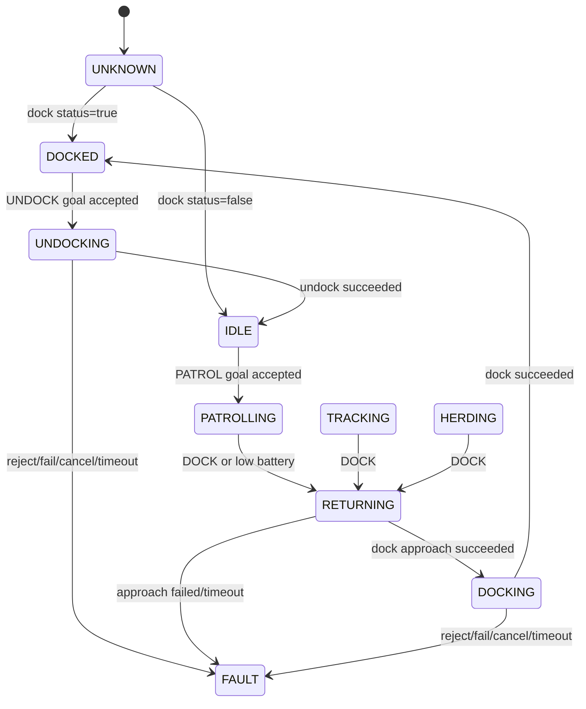

# 코드 리뷰 1~5번 문제 개선 설계

> 대상: 2026-08-06 코드 리뷰에서 확인한 1~5번 문제
>
> 이 문서는 구현 전에 상태·명령 계약과 실패 복구 정책을 확정하기 위한 설계다.
> 실제 Python, YAML, 인터페이스 코드는 이 문서 작성 과정에서 변경하지 않는다.

## 1. 범위

다음 문제만 다룬다.

1. 도킹 중인 로봇 B에 `HERD`를 바로 보내고, 실제 몰이 goal도 없는 문제
2. 모든 `detector_node`가 다른 로봇의 `TRACK` 명령에도 반응하는 문제
3. dock/undock 성공 전에 `PATROLLING`/`DOCKED`로 보고하는 문제
4. opening 처리 상태기계가 TF·Nav2·DB·trap 응답 실패 시 영구 대기하는 문제
5. `TRACK` 진입 후 쥐를 다시 보지 못하면 `rat_lost`가 영원히 발생하지 않는 문제

6번 이후 리뷰 항목(activation 스크립트, 전역 trap 이벤트 교차 수신, 패키징 등)은
이 문서의 구현 범위에서 제외한다. 단, 1~5번을 해결하는 데 직접 필요한 계약 변경은
명시한다.

## 2. 설계 원칙

- **명령 수신과 동작 성공을 구분한다.** 상태는 명령을 받았다는 뜻이 아니라 실제
  로봇 동작 단계 또는 확인된 결과를 나타낸다.
- **언도킹과 후속 역할을 분리한다.** `UNDOCK`은 언도킹만 수행하고, 성공 후 중앙이
  `PATROL`, `TRACK`, `HERD` 중 하나를 별도로 보낸다.
- **모든 장기 대기에는 종료 경로가 있어야 한다.** 성공, 명시적 실패, timeout 중
  하나로 반드시 빠져나온다.
- **로봇별 노드는 자기 명령만 처리한다.** fleet 명령의 robot 필드는 모든 로컬
  노드에서 필수로 검사한다.
- **실패를 성공 상태로 축약하지 않는다.** 액션 거절·취소·실패·timeout은 `FAULT`
  또는 이전의 안전 상태로 보고한다.
- 상태기계 timeout에는 ROS 시뮬레이션 시간과 무관한 steady/monotonic clock을 쓴다.

## 3. 공통 fleet 상태·명령 계약

### 3.1 상태 정의

`/fleet/status`의 state 값에 다음 상태를 사용한다.

| 상태 | 의미 |
|---|---|
| `UNKNOWN` | 시작 직후로, 실제 dock 상태를 아직 확인하지 못했음 |
| `DOCKED` | dock 액션이 성공으로 끝났음 |
| `UNDOCKING` | undock goal이 수락되어 진행 중 |
| `IDLE` | 도크 밖에 있고 현재 Nav2 작업이 없음 |
| `PATROLLING` | waypoint goal이 수락되어 순찰 중 |
| `TRACKING` | 쥐 추적 역할 A로 동작 중 |
| `HERDING` | 쥐 몰이 역할 B로 동작 중 |
| `RETURNING` | 도크 앞 접근점으로 이동 중 |
| `DOCKING` | dock goal이 수락되어 정밀 도킹 중 |
| `FAULT` | 현재 명령을 안전하게 완료하지 못했으며 자동 성공 처리하면 안 됨 |

상태는 변경 즉시 한 번 발행하고, 기존 주기 보고도 유지한다. 중앙이 중간 상태를
놓쳐도 다음 주기 보고로 복구할 수 있어야 한다.

agent 시작 상태는 `IDLE`이나 `DOCKED`로 추정하지 않고 `UNKNOWN`으로 둔다.
`TurtleBot4Navigator`가 수신한 dock status(`is_docked`)가 처음 확인된 뒤에만
`DOCKED` 또는 `IDLE`로 전이한다. dock status가 아직 없으면 초기화 callback을
블로킹하지 않고 timer에서 계속 확인하며, 중앙은 `UNKNOWN` 로봇을 순찰·역할 후보로
사용하지 않는다.

### 3.2 명령 의미

| 명령 | 새 의미 |
|---|---|
| `UNDOCK` | 언도킹만 수행. 성공 시 `IDLE`; 자동 순찰 시작 금지 |
| `PATROL` | 도크 밖 `IDLE` 상태에서 waypoint 순찰 시작 |
| `TRACK` | 도크 밖 로봇을 추적 역할 A로 전환 |
| `HERD` | 도크 밖 로봇을 몰이 역할 B로 전환 |
| `DOCK` | 순찰/역할 goal을 취소하고 `RETURNING → DOCKING → DOCKED` 수행 |
| `STOP` | 진행 goal을 취소하고 도크 밖이면 `IDLE` |

`UNDOCK` 의미가 기존 구현과 달라지므로 `central_node`와 두 로봇의 `robot_agent`는
같은 배포 단위로 올려야 한다. 구버전 agent와 신버전 central의 혼용은 지원하지 않는다.

## 4. 문제 1 — 도킹된 B의 HERD 전환과 실제 몰이

### 4.1 중앙의 후속 명령 큐

`CentralNode`에 로봇별 단일 후속 명령을 보관한다.

```text
pending_after_undock: dict[robot, command]
```

공통 헬퍼 `request_activity(robot, desired_command)`의 동작은 다음과 같다.

| 현재 상태 | 처리 |
|---|---|
| `DOCKED` | `pending_after_undock[robot]=desired_command`, `UNDOCK` 발행 |
| `UNDOCKING` | 후속 명령만 desired_command로 갱신 |
| `IDLE` | desired_command 즉시 발행 |
| `PATROLLING` | `TRACK`/`HERD`면 즉시 역할 전환 가능 |
| `RETURNING`, `DOCKING`, `FAULT` | 사용할 수 없는 로봇으로 판단; 강제 역할 전환 금지 |

status callback에서 해당 로봇의 `IDLE`을 확인하면 pending 명령을 한 번 발행하고
항목을 제거한다. `PATROLLING`을 보고 pending을 제거하는 현재 방식은 없앤다.

### 4.2 순찰 부트스트랩과 교대

- 커버리지 확보 대상이 `DOCKED`면 `request_activity(robot, 'PATROL')`을 호출한다.
- agent가 `UNDOCKING`을 보고한 동안에는 추가 `UNDOCK`을 보내지 않는다.
- agent가 `IDLE`을 보고하면 중앙이 `PATROL`을 보낸다.
- `PATROLLING`은 실제 waypoint goal이 수락된 뒤에만 보고된다.
- `FAULT` 또는 `UNDOCKING` timeout이 발생하면 pending을 제거하고 다른 사용 가능
  로봇을 찾는다.

### 4.3 쥐 대응 진입

쥐 감지 시 A는 현재 `PATROLLING` 로봇으로 정한다. B 후보는 다음 우선순위로 고른다.

1. `IDLE`
2. `DOCKED`
3. 그 외 상태는 B 후보에서 제외

B가 `IDLE`이면 `HERD`를 바로 보내고, `DOCKED`면
`request_activity(B, 'HERD')`로 언도킹 후 몰이를 시작한다. A의 `TRACK`은 B의
언도킹을 기다리지 않고 즉시 시작한다.

B가 없거나 `FAULT`면 A 단독 추적으로 진입하되 `robot_b=None`을 기록하고 경고한다.
쥐 대응 자체를 무시하면 최초 감지 이후 복구할 기회가 사라지기 때문이다.



### 4.4 쥐 대응 도중 종료되는 경우

`rat_captured` 또는 `rat_lost`가 B 언도킹 도중 발생할 수 있다.

- A에는 `PATROL`을 보낸다.
- B의 pending `HERD`는 제거한다.
- B가 이미 `IDLE`/`HERDING`이면 `DOCK`을 보낸다.
- B가 `UNDOCKING`이면 후속 명령을 `DOCK`으로 교체한다. 언도킹 완료 후 `IDLE`
  status를 받았을 때 즉시 `DOCK`을 보낸다.
- B가 아직 `DOCKED`면 추가 명령을 보내지 않는다.

### 4.5 실제 몰이 goal

현재 `RatHerdingNode.event_cb()`의 TODO를 다음 계약으로 구현한다.

1. detector A는 추적 중 최신 쥐 map 좌표를 별도 typed topic으로 주기 발행한다.
2. 권장 인터페이스는 `turtle_interfaces/msg/RatObservation`이다.

   ```text
   builtin_interfaces/Time stamp
   string robot
   float64 x
   float64 y
   ```

3. `RatHerdingNode`는 `HERD` 명령을 받은 B가 있을 때만 observation을 처리한다.
4. `herd_target_x/y`를 쥐를 유도할 목표점으로 두고, 쥐를 기준으로 목표점 반대편
   `herd_standoff` 위치를 B의 goal로 계산한다.

   ```text
   unit = normalize(rat - herd_target)
   B_goal = rat + herd_standoff * unit
   yaw = direction(B_goal -> rat)
   ```

5. goal은 `herd_goal_period`보다 자주 발행하지 않고, 이전 goal과
   `herd_goal_min_delta` 이상 달라졌을 때만 갱신한다.
6. `PATROL`, `DOCK`, `STOP` 또는 다른 B에 대한 `HERD`를 받으면 기존 B 역할과
   publisher 상태를 정리한다.
7. `herd_target_x/y`가 설정되지 않았거나 유효한 observation이 없으면 임의 goal을
   만들지 않고 오류 상태를 중앙 로그로 표출한다.

기존 `/fleet/event`의 최초 `rat_detected`는 중앙 트리거로 유지한다. 연속 위치는
typed topic으로 분리하여 문자열 파싱과 최초 이벤트 유실 순서 문제를 피한다.

## 5. 문제 2 — detector 명령 대상 필터링

### 5.1 로봇 ID 결정

각 `DetectorNode`는 시작 시 자기 로봇 ID를 한 번 확정한다.

- 기본값: `self.get_namespace()`의 마지막 구성요소 (`/robot4` → `robot4`)
- 선택적 `robot_id` 파라미터가 있으면 namespace 값과 일치하는지 검증
- root namespace이거나 값이 서로 다르면 시작 실패 처리

조용히 `robot4`를 기본값으로 사용하는 방식은 잘못 실행된 robot6 detector가
robot4 명령을 받게 만들 수 있으므로 금지한다.

### 5.2 command callback 규칙

모든 명령 callback의 첫 단계는 다음 논리여야 한다.

```text
robot, cmd = parse_command(msg.data)
if robot != self.robot_id:
    return
```

그 뒤에만 `TRACK`, `PATROL`, `STOP`, `DOCK` 전이를 처리한다. 같은 규칙을
`RobotAgent`뿐 아니라 detector와 역할을 동적으로 받는 다른 로컬 노드의 공통
계약으로 문서화한다.

### 5.3 중복 명령

- 이미 tracking 중인 같은 로봇의 중복 `TRACK`은 타이머를 초기화하지 않는다.
- 다른 로봇의 모든 명령은 내부 상태에 아무 영향도 주지 않는다.
- tracking 종료 후 도착한 오래된 `TRACK`을 구분할 수 있도록 장기적으로는 명령에
  operation ID를 넣는 것이 바람직하지만, 이번 범위에서는 DDS 순서 보장과
  idempotent callback으로 제한한다.

## 6. 문제 3 — dock/undock과 순찰 상태의 진실성

### 6.1 RobotAgent 전이



세부 규칙은 다음과 같다.

- `UNDOCK` 수신 즉시 `PATROLLING`으로 바꾸지 않는다.
- undock goal이 실제로 수락된 뒤 `UNDOCKING`을 보고한다.
- undock result가 `STATUS_SUCCEEDED`일 때만 `IDLE`로 전이한다.
- `PATROL`은 waypoint 파일 로드·검증과 goal 수락이 끝난 뒤 `PATROLLING`으로
  전이한다. 파일 없음, 빈 목록, YAML 오류, goal 거절은 `PATROLLING`이 아니다.
- 도크 접근 중에는 `RETURNING`, dock goal 수락 후에는 `DOCKING`을 보고한다.
- dock result가 `STATUS_SUCCEEDED`일 때만 `DOCKED`로 전이한다.
- 액션의 “future가 완료됨”과 “동작이 성공함”을 구분한다.

### 6.2 액션 결과 래퍼

현재 navigator의 `isDockComplete()`/`isUndockComplete()`는 실패한 goal도
“완료”로 반환할 수 있으므로, RobotAgent 내부에 결과를 다음 네 값으로 정규화하는
래퍼를 둔다.

```text
IN_PROGRESS | SUCCEEDED | FAILED | CANCELED
```

- result future가 없거나 goal이 거절되면 `FAILED`
- status가 `GoalStatus.STATUS_SUCCEEDED`인 경우만 `SUCCEEDED`
- 취소 상태는 `CANCELED`
- timeout은 goal을 취소한 후 `FAILED`

내부 라이브러리에 공개 result getter가 없다면 result future/status를 캡슐화한
adapter를 만들고, `is*Complete()`의 bool만으로 성공을 판정하지 않는다.

### 6.3 timeout과 FAULT 복구

다음 파라미터를 둔다.

| 파라미터 | 용도 | 초기 권장값 |
|---|---|---|
| `undock_timeout_sec` | 언도킹 최대 시간 | 30초 |
| `dock_approach_timeout_sec` | 도크 앞 이동 최대 시간 | 90초 |
| `dock_timeout_sec` | 정밀 도킹 최대 시간 | 60초 |

`FAULT` 상태에서는 자동으로 `PATROLLING` 또는 `DOCKED`라고 보고하지 않는다.
중앙은 해당 로봇을 커버리지·역할 후보에서 제외하고, 운영자가 재시도 명령 또는
명시적 상태 복구를 수행하게 한다.

## 7. 문제 4 — opening 상태기계의 유한 대기와 hold lease

### 7.1 공통 전이 도우미

DetectorNode에 모든 상태 진입을 한곳에서 수행하는 전이 도우미를 둔다.

```text
transition(new_state, timeout_sec=None, await_kind=None)
```

이 도우미는 다음을 함께 기록한다.

- `state`
- `state_entered_at` (steady clock)
- `state_deadline`
- `await_kind`: `db`, `install`, `inspect` 등
- 현재 opening 작업을 구분하는 `operation_id`

별도 watchdog timer가 deadline을 검사하며, 각 상태에는 반드시 timeout handler가
있어야 한다. 비동기 DB callback과 trap 응답은 자신의 operation ID와 현재 state가
일치할 때만 적용한다.

### 7.2 상태별 timeout 정책

| 상태 | timeout | timeout/오류 처리 |
|---|---:|---|
| `APPROACHING` | `approach_timeout_sec` 60초 | 접근 goal 포기, opening 작업 종료, 순찰 재개 |
| `QUERYING` | `db_timeout_sec` 5초 | DB 없음과 동일하게 신규 검증으로 진행 |
| `VERIFYING` | `verify_timeout_sec` 10초 | 검증 실패로 종료, 순찰 재개 |
| `AWAIT_TRAP/install` | `trap_install_timeout_sec` 20초 | 재설치 카운트 증가 후 재요청; 한도 초과 시 종료 |
| `AWAIT_TRAP/inspect` | `trap_inspect_timeout_sec` 5초 | inspect 재요청 또는 재설치; 한도 초과 시 종료 |
| `INSPECTING` | `trap_detect_timeout_sec` 10초 | 기존 정책대로 재설치; 한도 초과 시 종료 |

기존 `verify_timeout`은 프레임 수처럼 쓰여 실제 시간이 FPS에 따라 달라진다. 이를
초 단위 wall timeout으로 바꾸고, 유효 프레임 최소 개수가 필요하면
`verify_min_frames`라는 별도 파라미터로 분리한다.

### 7.3 TF 실패 시 hold 순서

opening 발견 시 처리 순서를 다음과 같이 바꾼다.

1. bbox의 map 좌표 계산
2. robot map 좌표 TF 조회
3. 접근 goal 계산 성공 확인
4. 그 뒤에만 `patrol_hold=True` 발행
5. 접근 goal 발행 및 `APPROACHING` 진입

TF 조회나 goal 계산이 실패하면 hold를 걸지 않고 `SEARCHING`을 유지한다. 이미
hold를 소유한 뒤 발생한 모든 오류는 공통 `abort_opening(reason)`으로 모은다.

### 7.4 공통 종료 처리

`finish_opening()`과 `abort_opening()`은 결과 로그만 다르고 다음 정리는 동일하다.

- hold 해제
- `SEARCHING`으로 전이
- target, goal, hole, future, await_kind 초기화
- 이전 operation ID의 늦은 callback 무시
- 재설치/검증 카운터 초기화

### 7.5 detector 장애에 대비한 hold lease

Bool 한 번으로 hold를 영구 유지하면 detector 프로세스가 죽었을 때 agent가 계속
멈춘다. 다음 lease 방식을 사용한다.

- detector는 opening 작업 중 1초마다 `patrol_hold=True` heartbeat를 발행한다.
- RobotAgent는 마지막 True 수신 시각을 기록한다.
- `hold_lease_sec`(권장 3초) 동안 heartbeat가 없으면 hold를 자동 해제한다.
- 정상 종료 시 detector는 즉시 `False`를 발행한다.
- agent가 `PATROLLING` 상태일 때만 lease 만료 후 순찰을 재개한다.

이 방식은 detector 종료·네트워크 단절·예외로 인한 영구 정지를 막는다.

### 7.6 timeout 재시도와 늦은 trap 응답 구분

timeout 후 같은 구멍의 install을 재시도하면 이전 요청의 늦은
`trap_installed`가 새 요청의 성공처럼 보일 수 있다. 상태 이름과 좌표만으로는 이를
구분할 수 없으므로 로컬 detector↔trap_check 계약에 상관관계 ID를 추가한다.

- `TrapJob`에 `robot`, `operation_id`, `attempt_id`를 추가한다.
- trap_check 응답은 새 typed `TrapResult` 상대토픽으로 돌려준다.
- `TrapResult`는 동일한 세 ID와 `result`(`installed`, `ok`, `bad`, `failed`)를
  포함한다.
- detector는 현재 operation/attempt와 모두 일치하는 응답만 상태 전이에 사용한다.
- timeout으로 attempt가 증가한 뒤 도착한 이전 attempt 응답은 로그만 남기고 무시한다.
- `/fleet/event`의 `trap_installed/trap_ok/trap_bad`는 DB·관찰용으로 계속 발행할 수
  있지만 detector 상태 전이에는 사용하지 않는다.

이 변경은 전역 이벤트 교차 수신 문제 전체를 다루기 위한 것이 아니라, 4번 문제의
timeout/retry를 안전하게 만드는 데 필요한 최소 상관관계 계약이다.

## 8. 문제 5 — TRACK 직후 미재검출도 놓침으로 판정

### 8.1 RatTracker 시간 기준 추가

RatTracker에 `tracking_started_at`을 추가하고 명시적인 `start(now, seed=None)`을 둔다.

```text
loss_reference = last_seen if last_seen is not None else tracking_started_at
lost = now - loss_reference >= lost_secs
```

따라서 TRACK 진입 후 쥐를 한 번도 다시 보지 못해도 `lost_secs` 뒤에는 `rat_lost`가
발행된다. `reset()`은 anchor, last_seen, tracking_started_at을 모두 비운다.

### 8.2 최초 관측 seed

detector는 순찰 중 최초 `rat_detected`를 보낼 때 좌표와 steady timestamp를
`last_pretrack_observation`에 저장한다.

TRACK 명령을 받으면 다음과 같이 시작한다.

- 저장 관측이 `rat_seed_max_age_sec`(권장 2초) 이내면 그 좌표·시각을 seed로 사용
- 더 오래됐거나 없으면 명령 수신 시각을 `tracking_started_at`으로 사용
- 문제 2의 robot 필터를 통과한 detector만 이 처리를 수행

### 8.3 단발 종료 보장

- `rat_lost` 또는 `rat_captured` 발행 전에 tracking 종료 플래그를 원자적으로 세운다.
- 같은 timer/frame 주기에서 종료 이벤트가 두 번 발행되지 않게 한다.
- tracking 종료 후 늦게 들어온 frame은 새 `TRACK` 명령 전까지 포획/놓침 판정에
  사용하지 않는다.
- 카메라 frame 자체가 끊겨도 별도 `lost_tick` timer가 tracking 시작 시각을 기준으로
  동작하므로 놓침 판정이 가능해야 한다.

## 9. 파일별 예상 변경 범위

이 표는 구현 시 손댈 위치를 나타낼 뿐, 현재 단계에서는 변경하지 않는다.

| 파일 | 예정 변경 |
|---|---|
| `turtle_project/central_node.py` | pending 후속 명령, B 상태별 UNDOCK→HERD, 종료 중 pending 취소, 새 상태 처리 |
| `turtle_project/robot_agent.py` | 진실한 상태 전이, 액션 결과/timeout 래퍼, UNDOCK과 PATROL 분리, hold lease |
| `turtle_project/detector_node.py` | robot ID 필터, FSM deadline/watchdog, 안전한 hold 순서, DB 예외 처리, RatTracker start/seed |
| `turtle_project/rat_herding_node.py` | 역할 생명주기, typed rat observation 구독, 실제 몰이 goal 계산·제한 |
| `turtle_project/fleet_msg.py` | 상태 문자열 자체는 그대로 사용; 새 상태값 문서/self-check 보강 |
| `turtle_interfaces/msg/RatObservation.msg` | 연속 쥐 좌표용 typed 인터페이스 추가 |
| `turtle_interfaces/msg/TrapJob.msg` | robot/operation/attempt ID 추가 |
| `turtle_interfaces/msg/TrapResult.msg` | detector 상태 전이용 상관관계 포함 typed 응답 추가 |
| `config/robot4.yaml`, `config/robot6.yaml` | action timeout, hold lease, 몰이 파라미터의 로봇별 값 |

## 10. 테스트 설계

### 10.1 순수 단위 테스트

1. **중앙 후속 명령**
   - B=`DOCKED`, desired=`HERD` → `UNDOCK` 한 번 + pending HERD
   - B=`UNDOCKING` 반복 status → 중복 UNDOCK 없음
   - B=`IDLE` → HERD 한 번 + pending 제거
   - rat 종료가 UNDOCKING 중 발생 → pending HERD가 DOCK으로 교체

2. **명령 대상 필터**
   - robot4 detector에 `robot6:TRACK` → tracking 변화 없음
   - robot4 detector에 `robot4:TRACK` → tracking 시작
   - 다른 로봇의 PATROL/DOCK도 robot4 tracking을 종료하지 않음

3. **RobotAgent 결과 상태**
   - undock goal 거절/실패/취소/timeout 각각 `FAULT`
   - 성공만 `IDLE`
   - waypoint 파일 오류 시 `PATROLLING` 금지
   - dock 실패 시 `DOCKED` 금지

4. **opening watchdog**
   - TF 실패 전에는 hold가 발행되지 않음
   - APPROACHING/QUERYING/AWAIT_TRAP timeout마다 지정된 종료 경로 실행
   - DB future exception이 callback 밖으로 전파되지 않음
   - 늦게 도착한 이전 operation callback이 새 작업을 바꾸지 않음
   - timeout 전 attempt의 늦은 TrapResult가 현재 attempt를 완료시키지 않음
   - hold heartbeat 단절 후 agent가 lease를 해제함

5. **RatTracker**
   - TRACK 후 관측 0회 → lost_secs에 `rat_lost`
   - 유효 seed → seed 시각 기준 lost
   - 새 관측 → last_seen 기준 연장
   - capture와 lost가 같은 tick에 중복 발행되지 않음

### 10.2 2대 통합 테스트

다음 타임라인을 launch test 또는 fake navigator 기반 통합 테스트로 자동화한다.

```text
robot4 PATROLLING, robot6 DOCKED
→ rat_detected
→ robot4만 TRACKING
→ robot6 UNDOCKING (HERD 아직 아님)
→ robot6 IDLE
→ robot6 HERDING
→ rat_lost
→ robot4 PATROLLING, robot6 RETURNING→DOCKING→DOCKED
```

추가 실패 시나리오:

- robot6 undock 실패: robot6=`FAULT`, robot4 추적은 계속되며 HERD는 발행되지 않음
- detector A 카메라 단절: `lost_secs` 뒤 rat 대응 종료
- opening 접근 goal 실패: timeout 뒤 hold 해제 및 순찰 재개
- trap_check 미실행: AWAIT_TRAP timeout/retry 후 최종 hold 해제

## 11. 수용 기준

- robot4용 TRACK이 robot6 detector의 tracking 상태를 절대 바꾸지 않는다.
- 도킹된 B에는 HERD가 직접 발행되지 않고 반드시 `UNDOCKING → IDLE → HERDING`
  순서를 거친다.
- 액션 실패 상태에서 `PATROLLING` 또는 `DOCKED`가 한 번도 발행되지 않는다.
- detector의 모든 비-SEARCHING 상태에는 문서화된 timeout 종료 경로가 있다.
- detector 또는 trap_check가 중간에 종료되어도 로봇의 opening hold는 lease 만료 뒤
  자동 해제된다.
- TRACK 진입 후 추가 관측이 0개여도 `lost_secs` 이내 오차 한 timer 주기 안에
  `rat_lost`가 정확히 한 번 발행된다.
- 위 단위·통합 테스트가 CI에서 실행되며 기존 `_self_check()`에만 의존하지 않는다.

## 12. 구현 순서

1. 상태·명령 계약과 중앙 pending 로직을 단위 테스트로 먼저 고정
2. RobotAgent의 action 결과/timeout 및 `UNDOCK → IDLE` 전이 구현
3. DetectorNode robot 필터와 RatTracker start/seed 구현
4. opening FSM deadline/watchdog와 hold lease 구현
5. RatObservation 인터페이스와 실제 herding goal 구현
6. 두 로봇 통합 타임라인 및 실패 시나리오 검증

1~2단계는 프로토콜 의미가 함께 바뀌므로 반드시 같은 배포에서 적용한다.
